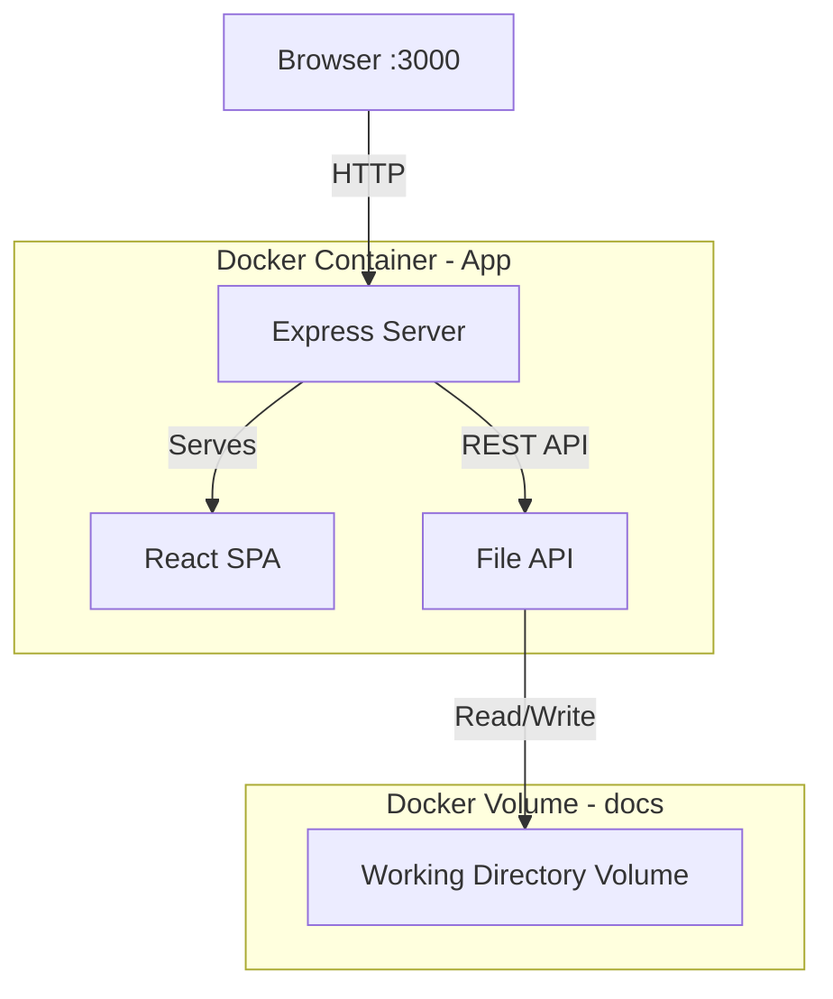
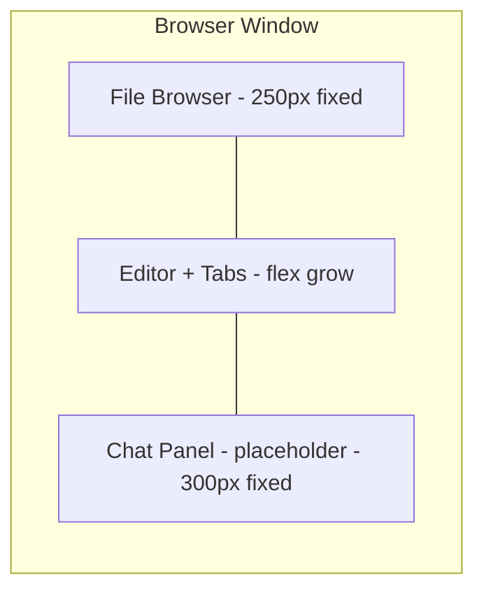

# Phase 1a — Single-User Editor in Docker

## Goal

Get a working Markdown editor running in a browser via Docker as quickly as possible. One user can browse files, open documents in tabs, and edit/save Markdown.

## Architecture



## Project Structure

```
collab-editor/
├── docker-compose.yml
├── Dockerfile
├── package.json
├── tsconfig.json
├── src/
│   ├── server/
│   │   ├── index.ts              # Express server entry point
│   │   ├── routes/
│   │   │   └── files.ts          # File CRUD REST API
│   │   └── services/
│   │       └── fileService.ts    # Filesystem operations
│   └── client/
│       ├── index.html            # SPA entry point
│       ├── main.tsx              # React entry point
│       ├── App.tsx               # Root layout - three panels
│       ├── components/
│       │   ├── FileBrowser/
│       │   │   ├── FileBrowser.tsx        # Tree view sidebar
│       │   │   ├── FileTreeItem.tsx       # Individual file/folder node
│       │   │   └── NewFileDialog.tsx      # Create file/folder modal
│       │   ├── Editor/
│       │   │   ├── EditorPanel.tsx        # Tab bar + active editor
│       │   │   ├── TabBar.tsx             # Open document tabs
│       │   │   ├── Tab.tsx               # Single tab component
│       │   │   └── MarkdownEditor.tsx     # BlockNote editor wrapper
│       │   └── ChatPanel/
│       │       └── ChatPanel.tsx          # Placeholder for Phase 1c
│       ├── hooks/
│       │   ├── useFileTree.ts            # Fetch and manage file tree state
│       │   └── useOpenFiles.ts           # Manage open tabs and active document
│       └── styles/
│           └── global.css                # Base layout styles
├── docs/                                  # Sample docs for testing - mounted volume
│   ├── welcome.md
│   └── example/
│       └── nested-doc.md
└── .env                                   # Environment variables
```

## Technology Choices

| Concern | Choice | Rationale |
|---|---|---|
| Server framework | Express + TypeScript | Lightweight, widely supported, easy to extend with WebSocket later |
| Client framework | React + TypeScript | BlockNote is a React component, natural fit |
| Bundler | Vite | Fast dev builds, good TypeScript support, simple config |
| Editor | BlockNote | Requirement — block-based Markdown editor with Y.js support built in |
| Markdown parsing | BlockNote built-in | Handles Markdown to/from BlockNote blocks |
| Styling | CSS Modules or plain CSS | Keep it simple; no CSS framework needed initially |

## Detailed Steps

### Step 1a.1 — Docker Compose with App Container

**What to build:**
- `Dockerfile` using Node 20 Alpine
- Multi-stage build: install deps, build client, run server
- `docker-compose.yml` with a single `app` service
- Mount a `docs` volume to `/app/docs` as the working directory
- Expose port 3000

**Files to create:**
- `collab-editor/Dockerfile`
- `collab-editor/docker-compose.yml`
- `collab-editor/.env`

**Docker Compose structure:**
```yaml
services:
  app:
    build: .
    ports:
      - 3000:3000
    volumes:
      - docs:/app/docs
    env_file: .env

volumes:
  docs:
```

**Environment variables for Phase 1a:**
```
DOCS_PATH=/app/docs
PORT=3000
```

**Acceptance criteria:**
- [ ] `docker compose up` builds and starts the container
- [ ] Browser at http://localhost:3000 shows the app
- [ ] The docs volume persists files across container restarts

---

### Step 1a.2 — BlockNote Editor: Open, Edit, Save

**What to build:**
- Express server serving the React SPA via Vite (dev mode) or static files (production)
- REST API endpoint `GET /api/files/:path` to read a Markdown file and return its content
- REST API endpoint `PUT /api/files/:path` to save Markdown content to disk
- `MarkdownEditor` React component wrapping BlockNote
- Load Markdown into BlockNote on file open
- Save BlockNote content back to Markdown on Ctrl+S / save button
- **Rich/Source mode toggle**: per-tab switch between BlockNote WYSIWYG and raw markdown textarea
  - Content syncs bidirectionally on mode switch
  - Source mode: monospace textarea with Tab-key indent support
  - Future: upgrades to CodeMirror 6 + Yjs (see `plans/source-mode-plan.md`)

**Files to create:**
- `collab-editor/package.json` — dependencies: express, @blocknote/core, @blocknote/react, @blocknote/mantine, react, react-dom, vite
- `collab-editor/tsconfig.json`
- `collab-editor/src/server/index.ts`
- `collab-editor/src/server/routes/files.ts`
- `collab-editor/src/server/services/fileService.ts`
- `collab-editor/src/client/index.html`
- `collab-editor/src/client/main.tsx`
- `collab-editor/src/client/App.tsx`
- `collab-editor/src/client/components/Editor/MarkdownEditor.tsx`
- `collab-editor/src/client/components/Editor/EditorPanel.tsx`

**REST API design:**

| Method | Path | Request Body | Response |
|---|---|---|---|
| GET | /api/files/*path | — | { content: string } |
| PUT | /api/files/*path | { content: string } | { success: true } |
| GET | /api/tree | — | FileTreeNode[] |
| POST | /api/files/*path | { type: file or dir } | { success: true } |
| DELETE | /api/files/*path | — | { success: true } |
| PATCH | /api/files/*path | { newPath: string } | { success: true } |

**FileTreeNode type:**
```typescript
interface FileTreeNode {
  name: string
  path: string        // relative to DOCS_PATH
  type: 'file' | 'dir'
  children?: FileTreeNode[]
}
```

**Key implementation details:**
- `fileService.ts` validates all paths stay within `DOCS_PATH` (prevent path traversal)
- BlockNote Markdown serialisation uses `@blocknote/core` built-in `blocksToMarkdown` / `markdownToBlocks`
- Save indicator in the tab: show unsaved state (dot or italic filename)

**Acceptance criteria:**
- [ ] Opening the app shows a blank editor
- [ ] Loading a Markdown file populates BlockNote with formatted content
- [ ] Editing and saving writes valid Markdown back to disk
- [ ] Path traversal attacks (e.g. `../../etc/passwd`) are rejected with 400
- [x] Rich/Source toggle switches between WYSIWYG and raw markdown per tab
- [x] Content syncs correctly in both directions on toggle

---

### Step 1a.3 — File Browser Sidebar

**What to build:**
- `FileBrowser` component: recursive tree view of the working directory
- Fetches file tree from `GET /api/tree`
- Folders expand/collapse
- Click a `.md` file to open it in the editor
- Right-click context menu or buttons for: New File, New Folder, Rename, Delete
- `NewFileDialog` modal for entering name when creating files/folders

**Files to create:**
- `collab-editor/src/client/components/FileBrowser/FileBrowser.tsx`
- `collab-editor/src/client/components/FileBrowser/FileTreeItem.tsx`
- `collab-editor/src/client/components/FileBrowser/NewFileDialog.tsx`
- `collab-editor/src/client/hooks/useFileTree.ts`

**Key implementation details:**
- Tree state managed by `useFileTree` hook which calls `GET /api/tree` and provides refresh
- File operations (create, rename, delete) call the corresponding REST endpoints then refresh the tree
- Confirm dialog before delete
- Only show `.md` files and directories (filter out non-Markdown files)
- Current open file highlighted in the tree

**Acceptance criteria:**
- [ ] Sidebar shows nested folder structure matching the docs volume
- [ ] Clicking a file opens it in the editor
- [ ] Can create new Markdown files and folders
- [ ] Can rename files and folders
- [ ] Can delete files and folders with confirmation
- [ ] Tree refreshes after each operation

---

### Step 1a.4 — Multi-Document Tab Support

**What to build:**
- `TabBar` component showing one tab per open document
- Click tab to switch active document
- Close button on each tab
- Unsaved indicator (dot) on tabs with pending changes
- `useOpenFiles` hook managing the list of open documents and active tab state
- Switching tabs preserves editor state for each document (BlockNote instance per tab, or content cache)
- Opening an already-open file switches to its existing tab

**Files to create:**
- `collab-editor/src/client/components/Editor/TabBar.tsx`
- `collab-editor/src/client/components/Editor/Tab.tsx`
- `collab-editor/src/client/hooks/useOpenFiles.ts`

**Key implementation details:**
- `useOpenFiles` stores: `openFiles: Array of { path, name, content, isDirty }`, `activeFilePath: string`
- Closing a tab with unsaved changes shows a confirm/save/discard dialog
- If all tabs are closed, show a placeholder message
- Keyboard shortcut: Ctrl+S saves the active document

**Acceptance criteria:**
- [ ] Opening multiple files from the file browser creates multiple tabs
- [ ] Clicking a tab switches the editor to that document
- [ ] Closing a tab removes it; prompt if unsaved
- [ ] Unsaved changes show a visual indicator on the tab
- [ ] Ctrl+S saves the active document
- [ ] Opening an already-open file activates the existing tab (no duplicate)
- [x] Switching tabs preserves unsaved edits (uses working content, not saved content)

---

## Three-Panel Layout



The layout uses CSS flexbox:
- Left panel: 250px wide, collapsible
- Centre panel: fills remaining space
- Right panel: 300px wide, shows a "Chat coming in Phase 1c" placeholder

## Risk & Decisions

| Risk | Mitigation |
|---|---|
| BlockNote Markdown round-trip fidelity | Accepted: minor formatting loss is OK per requirements. Test with representative docs early. |
| BlockNote version compatibility | Pin BlockNote version in package.json. Use latest stable. |
| Large file performance | Defer: not expected in Phase 1a. Address if needed in Phase 1c context management. |

## Definition of Done — Phase 1a

- [x] `docker compose up` starts the app on port 3000
- [x] Single user can browse, create, rename, and delete Markdown files
- [x] Documents open in a block-based Markdown editor with tab support
- [x] Edits are saved to disk on Ctrl+S
- [x] Unsaved changes are indicated on tabs (● dirty indicator)
- [x] The working directory volume persists across container restarts
- [x] Rich/Source mode toggle: switch between BlockNote WYSIWYG and raw markdown textarea
- [x] Content syncs bidirectionally between Rich and Source modes
- [x] Tab switching preserves unsaved edits (uses working content, not last-saved)
- [x] Close-tab with unsaved changes prompts for confirmation

### Known Limitations (Phase 1a — by design)

- **No auto-save**: Changes must be saved manually with Ctrl+S (Cmd+S on Mac). Unsaved changes are lost on page reload. Auto-save is deferred to Phase 1b with Y.js periodic save.
- **No real-time collaboration**: Single-user only. Multi-user sync is Phase 1b.
- **Markdown round-trip fidelity**: Minor formatting differences may occur when converting between Rich and Source modes due to BlockNote's `blocksToMarkdownLossy()`.

### Bugs Fixed During Phase 1a

| # | Issue | Root Cause | Fix |
|---|-------|-----------|-----|
| 7 | Tab switching lost unsaved edits | `EditorPanel` passed `savedContent` instead of `content` | Changed prop to use working `content` |
| 8 | Rich mode typing duplicated characters | `useEffect` on `[content, editor]` re-ran `replaceBlocks` on every keystroke | Used `initialContentRef` + `[editor]` dependency only |
| 9 | Source→Rich mode didn't update | `replaceBlocks` called before `BlockNoteView` mounted | `pendingMarkdownRef` + deferred `useEffect` on `[mode, editor]` |
- [ ] No external service dependencies (no Git, no AI, no Forgejo)
