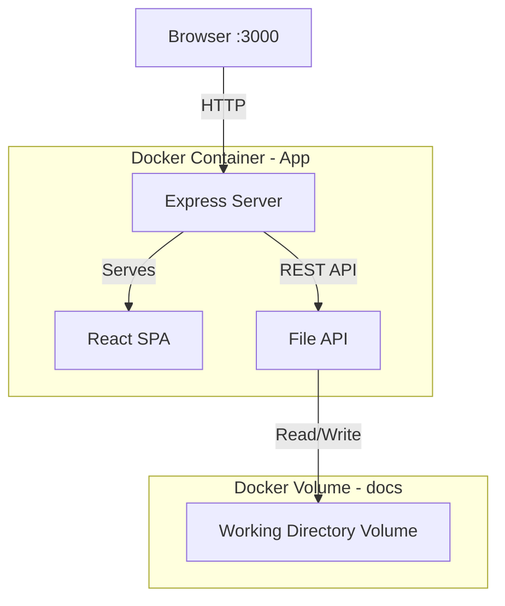
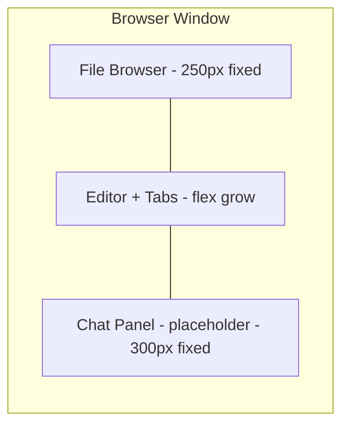

# Phase 1a — Single-User Editor in Docker

## Goal

Get a working Markdown editor running in a browser via Docker as quickly as possible. One user can browse files, open documents in tabs, and edit/save Markdown.

## Architecture



## Project Structure

```
├── .devcontainer/
│   ├── Dockerfile              # Devcontainer: Ubuntu + Node.js 20 + Docker CLI
│   └── devcontainer.json       # Devcontainer config with /tmp node_modules setup
├── docker-compose.yml
├── Dockerfile                  # Multi-stage Docker build (production)
├── package.json
├── tsconfig.json
├── tsconfig.server.json
├── vite.config.ts
├── src/
│   ├── server/
│   │   ├── index.ts              # Express server entry point
│   │   ├── routes/
│   │   │   └── files.ts          # File CRUD REST API
│   │   └── services/
│   │       └── fileService.ts    # Filesystem operations
│   └── client/
│       ├── index.html            # SPA entry point
│       ├── main.tsx              # React entry point
│       ├── App.tsx               # Root layout - three panels
│       ├── components/
│       │   ├── FileBrowser/
│       │   │   ├── FileBrowser.tsx        # Tree view sidebar
│       │   │   ├── FileTreeItem.tsx       # Individual file/folder node
│       │   │   └── NewFileDialog.tsx      # Create file/folder modal
│       │   ├── Editor/
│       │   │   ├── EditorPanel.tsx        # Tab bar + active editor
│       │   │   ├── TabBar.tsx             # Open document tabs
│       │   │   ├── Tab.tsx               # Single tab component
│       │   │   └── MarkdownEditor.tsx     # BlockNote editor wrapper
│       │   └── ChatPanel/
│       │       └── ChatPanel.tsx          # Placeholder for Phase 1c
│       ├── hooks/
│       │   ├── useFileTree.ts            # Fetch and manage file tree state
│       │   └── useOpenFiles.ts           # Manage open tabs and active document
│       └── styles/
│           └── global.css                # Base layout styles
├── docs/                                  # Sample docs for testing - mounted volume
│   ├── welcome.md
│   └── example/
│       └── nested-doc.md
└── .env                                   # Environment variables
```

## Technology Choices

| Concern | Choice | Rationale |
|---|---|---|
| Server framework | Express + TypeScript | Lightweight, widely supported, easy to extend with WebSocket later |
| Client framework | React + TypeScript | BlockNote is a React component, natural fit |
| Bundler | Vite | Fast dev builds, good TypeScript support, simple config |
| Editor | BlockNote | Requirement — block-based Markdown editor with Y.js support built in |
| Markdown parsing | BlockNote built-in | Handles Markdown to/from BlockNote blocks |
| Styling | CSS Modules or plain CSS | Keep it simple; no CSS framework needed initially |

## Detailed Steps

### Step 1a.1 — Docker Compose with App Container

**What to build:**
- `Dockerfile` using Node 20 Alpine
- Multi-stage build: install deps, build client, run server
- `docker-compose.yml` with a single `app` service
- Mount a `docs` volume to `/app/docs` as the working directory
- Expose port 3000

**Files to create:**
- `Dockerfile`
- `docker-compose.yml`
- `.env`

**Docker Compose structure:**
```yaml
services:
  app:
    build: .
    ports:
      - 3000:3000
    volumes:
      - docs:/app/docs
    env_file: .env

volumes:
  docs:
```

**Environment variables for Phase 1a:**
```
DOCS_PATH=/app/docs
PORT=3000
```

**Acceptance criteria:**
- [ ] `docker compose up` builds and starts the container
- [ ] Browser at http://localhost:3000 shows the app
- [ ] The docs volume persists files across container restarts

---

### Step 1a.2 — BlockNote Editor: Open, Edit, Save

**What to build:**
- Express server serving the React SPA via Vite (dev mode) or static files (production)
- REST API endpoint `GET /api/files/:path` to read a Markdown file and return its content
- REST API endpoint `PUT /api/files/:path` to save Markdown content to disk
- `MarkdownEditor` React component wrapping BlockNote
- Load Markdown into BlockNote on file open
- Save BlockNote content back to Markdown on Ctrl+S / save button
- **Rich/Source mode toggle**: per-tab switch between BlockNote WYSIWYG and raw markdown textarea
  - Content syncs bidirectionally on mode switch
  - Source mode: monospace textarea with Tab-key indent support
  - Future: upgrades to CodeMirror 6 + Yjs (see `plans/source-mode-plan.md`)

**Files to create:**
- `package.json` — dependencies: express, @blocknote/core, @blocknote/react, @blocknote/mantine, react, react-dom, vite
- `tsconfig.json`
- `src/server/index.ts`
- `src/server/routes/files.ts`
- `src/server/services/fileService.ts`
- `src/client/index.html`
- `src/client/main.tsx`
- `src/client/App.tsx`
- `src/client/components/Editor/MarkdownEditor.tsx`
- `src/client/components/Editor/EditorPanel.tsx`

**REST API design:**

| Method | Path | Request Body | Response |
|---|---|---|---|
| GET | /api/files/*path | — | { content: string } |
| PUT | /api/files/*path | { content: string } | { success: true } |
| GET | /api/tree | — | FileTreeNode[] |
| POST | /api/files/*path | { type: file or dir } | { success: true } |
| DELETE | /api/files/*path | — | { success: true } |
| PATCH | /api/files/*path | { newPath: string } | { success: true } |

**FileTreeNode type:**
```typescript
interface FileTreeNode {
  name: string
  path: string        // relative to DOCS_PATH
  type: 'file' | 'dir'
  children?: FileTreeNode[]
}
```

**Key implementation details:**
- `fileService.ts` validates all paths stay within `DOCS_PATH` (prevent path traversal)
- BlockNote Markdown serialisation uses `@blocknote/core` built-in `blocksToMarkdown` / `markdownToBlocks`
- Save indicator in the tab: show unsaved state (dot or italic filename)

**Acceptance criteria:**
- [ ] Opening the app shows a blank editor
- [ ] Loading a Markdown file populates BlockNote with formatted content
- [ ] Editing and saving writes valid Markdown back to disk
- [ ] Path traversal attacks (e.g. `../../etc/passwd`) are rejected with 400
- [x] Rich/Source toggle switches between WYSIWYG and raw markdown per tab
- [x] Content syncs correctly in both directions on toggle

---

### Step 1a.3 — File Browser Sidebar

**What to build:**
- `FileBrowser` component: recursive tree view of the working directory
- Fetches file tree from `GET /api/tree`
- Folders expand/collapse
- Click a `.md` file to open it in the editor
- Right-click context menu or buttons for: New File, New Folder, Rename, Delete
- `NewFileDialog` modal for entering name when creating files/folders

**Files to create:**
- `src/client/components/FileBrowser/FileBrowser.tsx`
- `src/client/components/FileBrowser/FileTreeItem.tsx`
- `src/client/components/FileBrowser/NewFileDialog.tsx`
- `src/client/hooks/useFileTree.ts`

**Key implementation details:**
- Tree state managed by `useFileTree` hook which calls `GET /api/tree` and provides refresh
- File operations (create, rename, delete) call the corresponding REST endpoints then refresh the tree
- Confirm dialog before delete
- Only show `.md` files and directories (filter out non-Markdown files)
- Current open file highlighted in the tree

**Acceptance criteria:**
- [ ] Sidebar shows nested folder structure matching the docs volume
- [ ] Clicking a file opens it in the editor
- [ ] Can create new Markdown files and folders
- [ ] Can rename files and folders
- [ ] Can delete files and folders with confirmation
- [ ] Tree refreshes after each operation

---

### Step 1a.4 — Multi-Document Tab Support

**What to build:**
- `TabBar` component showing one tab per open document
- Click tab to switch active document
- Close button on each tab
- Unsaved indicator (dot) on tabs with pending changes
- `useOpenFiles` hook managing the list of open documents and active tab state
- Switching tabs preserves editor state for each document (BlockNote instance per tab, or content cache)
- Opening an already-open file switches to its existing tab

**Files to create:**
- `src/client/components/Editor/TabBar.tsx`
- `src/client/components/Editor/Tab.tsx`
- `src/client/hooks/useOpenFiles.ts`

**Key implementation details:**
- `useOpenFiles` stores: `openFiles: Array of { path, name, content, isDirty }`, `activeFilePath: string`
- Closing a tab with unsaved changes shows a confirm/save/discard dialog
- If all tabs are closed, show a placeholder message
- Keyboard shortcut: Ctrl+S saves the active document

**Acceptance criteria:**
- [ ] Opening multiple files from the file browser creates multiple tabs
- [ ] Clicking a tab switches the editor to that document
- [ ] Closing a tab removes it; prompt if unsaved
- [ ] Unsaved changes show a visual indicator on the tab
- [ ] Ctrl+S saves the active document
- [ ] Opening an already-open file activates the existing tab (no duplicate)
- [x] Switching tabs preserves unsaved edits (uses working content, not saved content)

---

## Three-Panel Layout



The layout uses CSS flexbox:
- Left panel: 250px wide, collapsible
- Centre panel: fills remaining space
- Right panel: 300px wide, shows a "Chat coming in Phase 1c" placeholder

## Risk & Decisions

| Risk | Mitigation |
|---|---|
| BlockNote Markdown round-trip fidelity | Accepted: minor formatting loss is OK per requirements. Test with representative docs early. |
| BlockNote version compatibility | Pin BlockNote version in package.json. Use latest stable. |
| Large file performance | Defer: not expected in Phase 1a. Address if needed in Phase 1c context management. |

## Definition of Done — Phase 1a

- [x] `docker compose up` starts the app on port 3000
- [x] Single user can browse, create, rename, and delete Markdown files
- [x] Documents open in a block-based Markdown editor with tab support
- [x] Edits are saved to disk on Ctrl+S
- [x] Unsaved changes are indicated on tabs (● dirty indicator)
- [x] The working directory volume persists across container restarts
- [x] Rich/Source mode toggle: switch between BlockNote WYSIWYG and raw markdown textarea
- [x] Content syncs bidirectionally between Rich and Source modes
- [x] Tab switching preserves unsaved edits (uses working content, not last-saved)
- [x] Close-tab with unsaved changes prompts for confirmation

### Known Limitations (Phase 1a — by design)

- **No auto-save**: Changes must be saved manually with Ctrl+S (Cmd+S on Mac). Unsaved changes are lost on page reload. Auto-save is deferred to Phase 1b with Y.js periodic save.
- **No real-time collaboration**: Single-user only. Multi-user sync is Phase 1b.
- **Markdown round-trip fidelity**: Minor formatting differences may occur when converting between Rich and Source modes due to BlockNote's `blocksToMarkdownLossy()`.

### Bugs Fixed During Phase 1a

See [`dev-issues.md`](dev-issues.md) for full write-ups (DEV-ISSUE-001 through DEV-ISSUE-008).

---

## Implementation Log

### Date: 2 March 2026

### Overview

Phase 1A delivered a single-user Markdown editor running in Docker with an Express+TypeScript backend, React+BlockNote frontend, file browser sidebar, and multi-document tab support. All acceptance criteria from this plan were met.

### Issues Encountered & Resolutions

#### 1. Node.js Not Available in Devcontainer

**Problem**: The devcontainer environment did not have Node.js installed. Running `npm install` failed with `npm: not found`.

**Resolution**: Added Node.js 20 LTS installation to `.devcontainer/Dockerfile` via the NodeSource apt repository:
```dockerfile
RUN curl -fsSL https://deb.nodesource.com/setup_20.x | bash - && \
    apt-get install -y nodejs
```

Node.js is now always available when the devcontainer is built.

**Lesson**: Don't assume runtime availability in devcontainers — add required runtimes to the `.devcontainer/Dockerfile` so the environment is reproducible.

#### 2. Slow Mapped Filesystem for node_modules

**Problem**: The devcontainer workspace directory is bind-mounted from the host, which is very slow for the thousands of small files in `node_modules`. Running `npm install` directly in the workspace would be painfully slow and impact builds.

**Resolution**: Configured `devcontainer.json` with a `postCreateCommand` that installs dependencies in `/tmp/collab-editor-deps` (Docker filesystem — fast) and creates a symlink into the workspace:
```jsonc
// .devcontainer/devcontainer.json
"postCreateCommand": "mkdir -p /tmp/collab-editor-deps && cp package.json package-lock.json /tmp/collab-editor-deps/ && cd /tmp/collab-editor-deps && npm install && ln -sf /tmp/collab-editor-deps/node_modules ${containerWorkspaceFolder}/node_modules"
```

This runs automatically when the devcontainer is created. To manually re-install after changing `package.json`:
```bash
cp package.json package-lock.json /tmp/collab-editor-deps/
cd /tmp/collab-editor-deps && npm install
```

**Trade-off**: The symlink is ephemeral — if the devcontainer is rebuilt, the `postCreateCommand` re-runs automatically. The `package.json` and `package-lock.json` remain in the workspace for Git tracking.

**Lesson**: For bind-mounted filesystems in devcontainers, always relocate `node_modules` to the Docker filesystem (`/tmp` or similar) and use the `postCreateCommand` to automate the setup.

#### 3. VS Code Port Forwarding Conflict with Docker Port Mapping

**Problem**: The devcontainer uses Docker-from-Docker (host Docker socket mounted at `/var/run/docker.sock`). When running `docker compose up` with `ports: "3000:3000"`, the app was not reachable from the host at `localhost:3000`. The container was running correctly (verified via `docker exec` from inside the container).

**Root cause**: VS Code Dev Containers monitors the Docker socket and auto-detects exposed/published ports on sibling containers. It then sets up its own port forwarding, which conflicts with Docker's native `ports` host binding. The two forwarding mechanisms clash, preventing either from working correctly.

**Resolution**: Two changes:
1. Kept Docker's native `ports: "3000:3000"` mapping in `docker-compose.yml` for direct host access
2. Added `portsAttributes` to `.devcontainer/devcontainer.json` to tell VS Code to **ignore** port 3000:
   ```jsonc
   "portsAttributes": {
     "3000": {
       "label": "Collab Editor",
       "onAutoForward": "ignore"
     }
   }
   ```

With VS Code's auto-forwarding disabled for port 3000, Docker's native port mapping works as expected and the app is accessible from the host at `http://localhost:3000`.

**Lesson**: When using Docker-from-Docker in a devcontainer, VS Code's automatic port forwarding can conflict with Docker's native `ports` mapping. Use `"onAutoForward": "ignore"` in `portsAttributes` for ports managed by sibling containers to prevent the conflict.

#### 4. BusyBox wget Limitations in Alpine

**Problem**: The Docker image uses Alpine Linux, which ships BusyBox `wget` instead of GNU wget. BusyBox `wget` does not support `--method=PUT` or `--method=DELETE`, making it impossible to test PUT/DELETE/PATCH API endpoints with `wget`.

**Resolution**: Used Node.js `fetch()` (available in Node 20) from inside the container to test all HTTP methods:
```bash
docker compose exec app node /tmp/test-api.mjs
```

**Lesson**: For API testing in Alpine containers, use `node -e` with `fetch()` rather than relying on BusyBox `wget`. Alternatively, install `curl` in the Docker image if comprehensive HTTP testing is needed.

#### 5. TypeScript Module Resolution Strategy

**Problem**: The project needs two separate TypeScript configurations — one for the Vite-bundled client (React JSX, ESM, `noEmit`) and one for the server (CommonJS output to `dist/server`). Using a single `tsconfig.json` would create conflicts.

**Resolution**: Created two configs:
- `tsconfig.json` — Client-side: `jsx: react-jsx`, `moduleResolution: bundler`, `noEmit: true` (Vite handles bundling)
- `tsconfig.server.json` — Server-side: `module: NodeNext`, `moduleResolution: NodeNext`, `outDir: dist/server`, `rootDir: src/server`

The server build uses `tsc -p tsconfig.server.json` and the client build uses `vite build`.

**Lesson**: Multi-target TypeScript projects should use separate `tsconfig` files from the start to avoid configuration conflicts.

### Files Created

| File | Purpose |
|------|---------|
| `README.md` | Build, deploy, and development documentation |
| `Dockerfile` | Multi-stage build: builder + production |
| `docker-compose.yml` | Single app service, port 3000, named docs volume |
| `.env` | Environment variables |
| `docker-entrypoint.sh` | Seeds docs volume with sample files |
| `package.json` | Dependencies and build scripts |
| `tsconfig.json` | Client TypeScript config |
| `tsconfig.server.json` | Server TypeScript config |
| `vite.config.ts` | Vite bundler config with API proxy |
| `.devcontainer/Dockerfile` | Devcontainer: Ubuntu + Node.js 20 + Docker CLI |
| `.devcontainer/devcontainer.json` | Devcontainer config with /tmp node_modules setup |
| `src/server/index.ts` | Express server entry point |
| `src/server/routes/files.ts` | REST API routes for file operations |
| `src/server/services/fileService.ts` | Filesystem service with path traversal protection |
| `src/client/index.html` | SPA entry point |
| `src/client/main.tsx` | React entry with MantineProvider |
| `src/client/App.tsx` | Root layout with three panels |
| `src/client/styles/global.css` | All component styles |
| `src/client/hooks/useFileTree.ts` | File tree data fetching hook |
| `src/client/hooks/useOpenFiles.ts` | Open tabs state management hook |
| `src/client/components/Editor/MarkdownEditor.tsx` | BlockNote editor wrapper |
| `src/client/components/Editor/EditorPanel.tsx` | Tab bar + active editor panel |
| `src/client/components/Editor/TabBar.tsx` | Tab bar component |
| `src/client/components/Editor/Tab.tsx` | Single tab with dirty indicator |
| `src/client/components/FileBrowser/FileBrowser.tsx` | File tree sidebar |
| `src/client/components/FileBrowser/FileTreeItem.tsx` | Recursive tree node |
| `src/client/components/FileBrowser/NewFileDialog.tsx` | New file/folder dialog |
| `src/client/components/ChatPanel/ChatPanel.tsx` | Placeholder for Phase 1c |
| `docs/welcome.md` | Sample welcome document |
| `docs/example/nested-doc.md` | Sample nested document |
| `.gitignore` | Ignores node_modules, dist, logs |
| `.dockerignore` | Ignores node_modules, dist, .git |

### Test Results (All Passing)

| Test | Method | Result |
|------|--------|--------|
| File tree listing | `GET /api/tree` | ✅ Returns dirs + .md files recursively |
| Read file | `GET /api/files/welcome.md` | ✅ Returns content |
| Read nested file | `GET /api/files/example/nested-doc.md` | ✅ Returns content |
| Create file | `PUT /api/files/test.md` | ✅ Creates and returns success |
| Rename file | `PATCH /api/files/test.md` | ✅ Renames successfully |
| Delete file | `DELETE /api/files/test.md` | ✅ Removes file |
| Create directory | `POST /api/files/folder (type: dir)` | ✅ Creates directory |
| Path traversal blocked | `GET /api/files/..%2F..%2Fetc%2Fpasswd` | ✅ HTTP 400 |
| SPA serving | `GET /` | ✅ Returns index.html |
| Docker build | `docker compose build` | ✅ Multi-stage build succeeds |
| Docker run | `docker compose up` | ✅ Container starts, server runs on :3000 |
| Volume seeding | Entrypoint script | ✅ Sample docs created on first run |

#### 6. Rich/Source Mode Toggle

**Feature**: Added a toggle button in the editor toolbar that switches between BlockNote WYSIWYG (Rich) mode and a raw markdown textarea (Source) mode. Each tab independently tracks its own mode.

**Implementation**:
- `MarkdownEditor.tsx` gained `mode` state (`'rich' | 'source'`), a segmented toggle button, and a monospace `<textarea>` for source mode
- Toggle syncs content bidirectionally: Rich→Source via `blocksToMarkdownLossy()`, Source→Rich via `tryParseMarkdownToBlocks()`
- Tab key in source mode inserts 2 spaces instead of changing focus
- CSS styles added for `.editor-mode-toggle`, `.mode-toggle-btn`, `.source-textarea`
- Zero new dependencies

**Future upgrade path**: Plain textarea will be replaced with CodeMirror 6 + `y-codemirror.next` when Yjs collaboration is added in Phase 1b. Full plan documented in `plans/source-mode-plan.md`.

#### 7. Tab-Switching Content Loss Bug

See [DEV-ISSUE-006](dev-issues.md#dev-issue-006-tab-switching-lost-unsaved-edits) for details.

#### 8. Rich Mode Typing Duplication Bug

See [DEV-ISSUE-007](dev-issues.md#dev-issue-007-rich-mode-typing-duplicated-characters) for details.

#### 9. Source→Rich Mode Sync Bug

See [DEV-ISSUE-008](dev-issues.md#dev-issue-008-sourcerich-mode-didnt-update-editor-content) for details.

#### 10. Phase 1a Save Behaviour Clarification

**Observation**: User reported "changes are lost on reload." This is expected Phase 1a behaviour — save is manual via Ctrl+S only. The save flow is fully functional: `Ctrl+S` → `EditorPanel` keydown handler → `markSaved()` → `PUT /api/files/${path}` → server writes to disk. Unsaved changes show a ● dirty indicator on the tab, and closing a dirty tab prompts for confirmation. Auto-save (5-second periodic from Y.js state) is deferred to Phase 1b.
