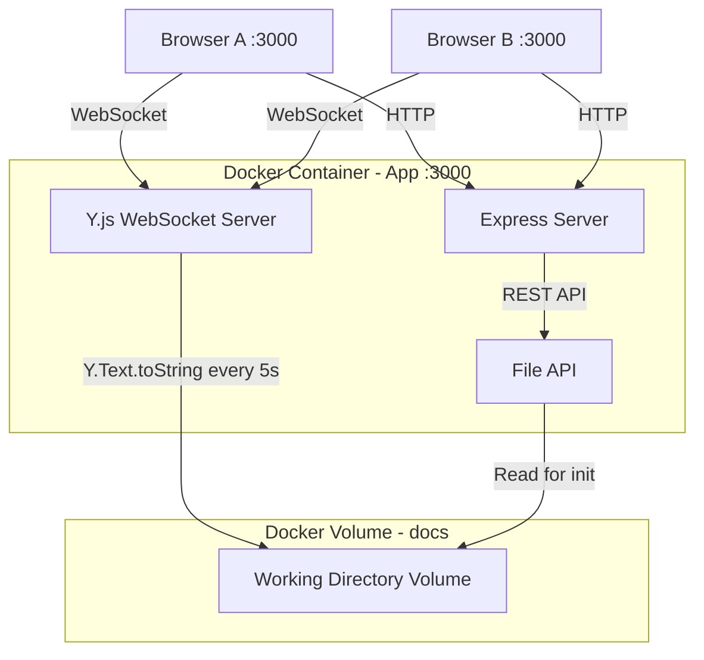
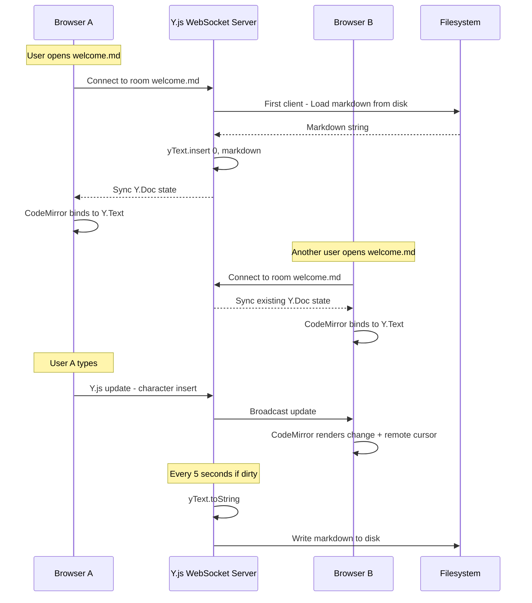
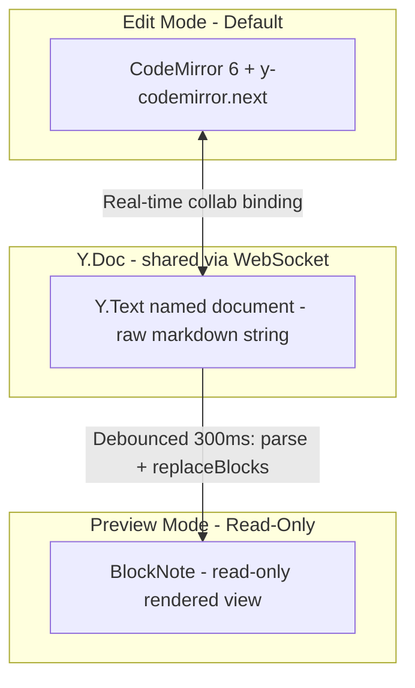

# Phase 1b — Real-Time Collaboration (Source-First)

## Goal

Add multi-user collaborative editing so changes appear in real time across browsers. The canonical document format is **markdown text** stored in a Y.js `Y.Text` CRDT. Users edit in CodeMirror 6 (source mode, default) with full real-time collaboration, and can toggle to a read-only BlockNote preview.

## Architecture



### Y.js Data Flow



### Editor Mode Architecture



## Key Design Decision: Source-First

Phase 1a used BlockNote as the primary editor with a source textarea as secondary. Phase 1b inverts this:

| Concern | Phase 1a | Phase 1b |
|---|---|---|
| Primary editor | BlockNote WYSIWYG | CodeMirror 6 markdown editor |
| Secondary view | Plain textarea | BlockNote read-only preview |
| Data model | Local string state | Y.Text CRDT - markdown string |
| Collaboration | None | Full - cursors, selections, live edits |
| Source of truth | Markdown string in React state | Y.Text in Y.Doc |
| Persistence | Manual Ctrl+S via REST | Auto-save Y.Text to disk every 5s |
| Markdown fidelity | Lossy via blocksToMarkdownLossy | Lossless - what you type is what gets saved |

**Rationale:**
- Y.Text is a flat string — it IS the markdown. No serialization needed for persistence.
- CodeMirror 6 has mature Y.js bindings via y-codemirror.next — full cursor awareness.
- BlockNote as read-only preview avoids the lossy serialize-deserialize round-trip.
- AI integration in Phase 1c becomes trivial — AI reads/writes markdown directly to Y.Text.
- No dependency on @blocknote/server-util for server-side operations.

## Project Structure Changes

New and modified files relative to Phase 1a:

```
├── src/
│   ├── server/
│   │   ├── index.ts                     # Modified: create HTTP server, attach WebSocket
│   │   ├── routes/
│   │   │   └── files.ts                 # Minor: remove debug logging
│   │   ├── services/
│   │   │   ├── fileService.ts           # Unchanged
│   │   │   ├── yjsService.ts            # NEW: Y.Doc room management, lifecycle
│   │   │   └── yjsPersistence.ts        # NEW: periodic save Y.Text to disk
│   │   └── ws/
│   │       └── yjsHandler.ts            # NEW: WebSocket upgrade + y-websocket
│   └── client/
│       ├── App.tsx                       # Modified: add UserIdentityProvider
│       ├── components/
│       │   ├── Editor/
│       │   │   ├── EditorPanel.tsx       # Modified: manage Y.js provider per tab
│       │   │   ├── SourceEditor.tsx      # NEW: CodeMirror 6 + Y.js collaborative editor
│       │   │   ├── PreviewPanel.tsx      # NEW: BlockNote read-only preview
│       │   │   ├── MarkdownEditor.tsx    # REMOVED: replaced by SourceEditor + PreviewPanel
│       │   │   ├── PresenceBar.tsx       # NEW: connected users display
│       │   │   ├── TabBar.tsx            # Modified: sync status indicators
│       │   │   └── Tab.tsx              # Modified: sync status instead of dirty dot
│       │   ├── UserIdentity/
│       │   │   └── UserNamePrompt.tsx    # NEW: display name entry dialog
│       │   └── ChatPanel/
│       │       └── ChatPanel.tsx         # Unchanged
│       ├── hooks/
│       │   ├── useFileTree.ts           # Unchanged
│       │   ├── useOpenFiles.ts          # Modified: simplified, Y.js owns content
│       │   ├── useYjsProvider.ts        # NEW: Y.Doc + WebSocketProvider per document
│       │   └── useUserIdentity.ts       # NEW: display name + color from localStorage
│       └── styles/
│           └── global.css               # Modified: CodeMirror + presence styles
```

## Technology Choices

| Concern | Choice | Rationale |
|---|---|---|
| Source editor | CodeMirror 6 | Best-in-class code/text editor with Y.js support |
| Markdown highlighting | @codemirror/lang-markdown | Native markdown syntax highlighting for CodeMirror |
| Real-time sync | Y.js + y-websocket | CRDT-based, Y.Text for plain text collaboration |
| CodeMirror Y.js binding | y-codemirror.next | Official Y.js binding for CodeMirror 6 |
| WebSocket server | ws via y-websocket | y-websocket uses ws internally |
| Preview renderer | BlockNote read-only | Already a dependency, renders markdown beautifully |
| User presence | Y.js awareness protocol | Built into Y.js, tracks connected users |
| User identity | localStorage | No auth needed; display name on first visit |

## Detailed Steps

### Step 1b.1 — Y.js WebSocket Server

**What to build:**
- WebSocket server running on the same HTTP server as Express (port 3000)
- Y.js document room management: one Y.Doc per file path
- WebSocket upgrade handler at path `/yjs/:roomName`
- Room lifecycle: create on first connection, initialize from disk, cleanup on idle

**New dependencies:**
```json
{
  "yjs": "^13.6",
  "y-websocket": "^2.0",
  "y-protocols": "^1.0",
  "ws": "^8.0",
  "lib0": "^0.2"
}
```

**Files to create/modify:**
- `src/server/ws/yjsHandler.ts` — NEW: WebSocket upgrade handler
- `src/server/services/yjsService.ts` — NEW: Y.Doc room manager
- `src/server/index.ts` — Modified: create `http.Server`, attach WebSocket upgrade

**Key implementation details:**

`src/server/index.ts` changes:
```typescript
// Before (Phase 1a):
app.listen(PORT, '0.0.0.0', () => { ... });

// After (Phase 1b):
import http from 'http';
import { setupYjsWebSocket } from './ws/yjsHandler.js';

const server = http.createServer(app);
setupYjsWebSocket(server);
server.listen(PORT, '0.0.0.0', () => { ... });
```

`src/server/services/yjsService.ts` — Room Manager:
```typescript
// Manages a Map<string, Y.Doc> of active rooms
// - getOrCreateDoc(roomName): returns existing or creates new Y.Doc
// - destroyDoc(roomName): saves to disk, removes from map
// - Room names = file paths (e.g., "welcome.md", "example/nested-doc.md")
// - Validate room names with safePath() to prevent path traversal
```

`src/server/ws/yjsHandler.ts` — WebSocket Handler:

We need a custom Y.js WebSocket handler rather than using `y-websocket/bin/utils` directly, because we need to:
1. Control Y.Doc initialization (load from disk on first connect)
2. Track connections per room for cleanup
3. Integrate with our persistence layer

The handler will implement the Y.js sync protocol using `y-protocols/sync` and `y-protocols/awareness`.

**Room naming convention:**
- Room name = URL-encoded file path relative to DOCS_PATH
- e.g., WebSocket URL: `ws://localhost:3000/yjs/example%2Fnested-doc.md`
- Decoded and validated server-side with `safePath()` from `fileService.ts`

**Acceptance criteria:**
- [ ] WebSocket server accepts connections at `ws://localhost:3000/yjs/:roomName`
- [ ] Multiple clients connecting to the same room share a Y.Doc
- [ ] Different room names create isolated Y.Docs
- [ ] No interference with existing Express HTTP routes
- [ ] Room names are validated against path traversal

---

### Step 1b.2 — CodeMirror 6 Collaborative Source Editor

**What to build:**
- CodeMirror 6 editor component with markdown syntax highlighting
- Y.js binding via y-codemirror.next for real-time collaboration
- Remote cursor and selection display with user names/colors
- Default editor mode (replaces BlockNote as primary editor)

**New dependencies:**
```json
{
  "codemirror": "^6.0",
  "@codemirror/lang-markdown": "^6.0",
  "@codemirror/language-data": "^6.0",
  "@codemirror/theme-one-dark": "^6.0",
  "y-codemirror.next": "^0.3"
}
```

**Files to create/modify:**
- `src/client/components/Editor/SourceEditor.tsx` — NEW: CodeMirror 6 wrapper with Y.js
- `src/client/hooks/useYjsProvider.ts` — NEW: Y.Doc + WebSocketProvider management
- `src/client/components/Editor/EditorPanel.tsx` — Modified: use SourceEditor, manage mode toggle
- `src/client/components/Editor/MarkdownEditor.tsx` — REMOVED (replaced)

**useYjsProvider hook:**

```typescript
interface UseYjsProviderOptions {
  roomName: string;           // File path as room name
  userName: string;           // Display name for awareness
  userColor: string;          // Cursor color
}

interface UseYjsProviderReturn {
  yDoc: Y.Doc;
  yText: Y.Text;             // The shared markdown text
  provider: WebsocketProvider;
  awareness: Awareness;
  isConnected: boolean;
  isSynced: boolean;          // True after initial sync with server
}
```

The hook:
1. Creates a `Y.Doc` instance
2. Creates a `WebsocketProvider` connecting to `ws://host/yjs/${roomName}`
3. Gets `yDoc.getText('document')` — the shared Y.Text
4. Sets awareness local state: `{ user: { name, color } }`
5. Tracks connection and sync status
6. Cleans up on unmount (destroy provider and doc)

**SourceEditor component:**

```typescript
interface SourceEditorProps {
  yText: Y.Text;
  awareness: Awareness;
  isSynced: boolean;
}
```

The component:
1. Creates a CodeMirror `EditorView` with extensions:
   - `markdown()` language support from `@codemirror/lang-markdown`
   - `yCollab(yText, awareness)` from `y-codemirror.next`
   - Light theme (matching existing app style) or dark theme toggle
   - Basic keybindings (undo/redo via Y.js `UndoManager`)
   - Line numbers, bracket matching, etc.
2. Mounts into a div ref
3. Shows "Connecting..." placeholder until `isSynced` is true
4. Cleans up `EditorView` on unmount

**Changes to content flow:**

| Phase 1a | Phase 1b |
|---|---|
| `openFile()` → REST `GET /api/files/:path` → local state | `openFile()` → Y.js WebSocket connect → Y.Text sync |
| `onChange` → update local state → Ctrl+S → REST PUT | Y.Text changes → auto-broadcast → server auto-save |
| `content` prop passed to editor | Y.Text binding — editor reads/writes Y.Text directly |

**Acceptance criteria:**
- [ ] CodeMirror 6 editor renders with markdown syntax highlighting
- [ ] Two browsers editing the same file see each other's changes in real time
- [ ] Remote cursors show with user name labels and colors
- [ ] Undo/redo works per-user via Y.js UndoManager
- [ ] Editor shows "Connecting..." until initial sync is complete
- [ ] Opening a different tab creates a new Y.js connection
- [ ] Closing a tab disconnects from the Y.js room

---

### Step 1b.3 — Read-Only BlockNote Preview

**What to build:**
- BlockNote in read-only mode as a markdown preview
- Updates live from Y.Text changes (debounced)
- Toggle button: Edit (CodeMirror) / Preview (BlockNote)
- Preview is per-tab — each tab tracks its own mode

**Files to create/modify:**
- `src/client/components/Editor/PreviewPanel.tsx` — NEW: read-only BlockNote preview
- `src/client/components/Editor/EditorPanel.tsx` — Modified: Edit/Preview toggle

**PreviewPanel component:**

```typescript
interface PreviewPanelProps {
  yText: Y.Text;    // Subscribe to changes
}
```

The component:
1. Creates a BlockNote editor via `useCreateBlockNote()` (no collaboration config)
2. Observes `yText` changes via `yText.observe()`
3. On change (debounced 300ms): `tryParseMarkdownToBlocks(yText.toString())` → `replaceBlocks()`
4. Renders `<BlockNoteView editor={editor} editable={false} />`
5. Shows formatted markdown: headings, lists, code blocks, links, etc.

**Mode toggle:**
- Two-button segmented control: "Edit" | "Preview"
- Default: Edit (CodeMirror)
- Preview is read-only — no editing possible
- Both modes stay connected to Y.js (preview observes Y.Text changes)

**Acceptance criteria:**
- [ ] Preview mode renders markdown content as formatted blocks
- [ ] Preview updates live when other users edit in source mode (debounced)
- [ ] Toggle between Edit and Preview preserves scroll position (best effort)
- [ ] Preview is strictly read-only — no editing possible
- [ ] Each tab independently tracks its Edit/Preview mode

---

### Step 1b.4 — Server-Side Periodic Save to Disk

**What to build:**
- Y.Doc initialization: load markdown from disk into Y.Text on first connection
- Periodic save: every 5 seconds, write dirty Y.Text to markdown files on disk
- Save on room cleanup (all clients disconnected)
- Force-save endpoint for Ctrl+S

**Files to create/modify:**
- `src/server/services/yjsPersistence.ts` — NEW: init from disk, periodic save
- `src/server/services/yjsService.ts` — Modified: integrate persistence
- `src/server/routes/files.ts` — Modified: add force-save endpoint

**Y.Doc initialization (trivial with Y.Text):**

```typescript
async function initDocFromDisk(roomName: string, yDoc: Y.Doc): Promise<void> {
  const docsPath = getDocsPath();
  try {
    const markdown = await readFileContent(docsPath, roomName);
    const yText = yDoc.getText('document');
    yDoc.transact(() => {
      yText.insert(0, markdown);
    });
  } catch (err: any) {
    if (err.code === 'ENOENT') {
      // New file — Y.Text starts empty
      console.log(`New document: ${roomName}`);
    } else {
      throw err;
    }
  }
}
```

**Periodic save (trivial with Y.Text):**

```typescript
const dirtyDocs = new Set<string>();

// Called when any Y.Doc is updated
function markDirty(roomName: string) {
  dirtyDocs.add(roomName);
}

// Runs every 5 seconds
async function saveLoop() {
  for (const roomName of dirtyDocs) {
    const yDoc = getDoc(roomName);
    if (!yDoc) continue;
    const markdown = yDoc.getText('document').toString();
    await writeFileContent(docsPath, roomName, markdown);
    dirtyDocs.delete(roomName);
  }
}

setInterval(saveLoop, 5000);
```

No serialization libraries. No `normalizeMarkdown()`. No `blocksToMarkdownLossy()`. Just `yText.toString()`.

**Force-save endpoint:**
```
POST /api/save/:path
```
Immediately writes the Y.Text for that room to disk. Used by Ctrl+S for user confidence.

**Room cleanup:**
When all clients disconnect from a room:
1. Wait 30 seconds (grace period for reconnection)
2. If still no clients: force save, then destroy Y.Doc to free memory
3. Log cleanup for debugging

**Acceptance criteria:**
- [ ] Opening a document loads its content from disk into Y.Text
- [ ] Edits auto-save to disk within 5 seconds
- [ ] The saved file is byte-identical to what users typed (lossless)
- [ ] Ctrl+S triggers immediate save and confirms success
- [ ] Room cleanup saves final state before releasing resources
- [ ] New files (created via file browser) initialize with empty Y.Text
- [ ] Multiple rapid edits batch into a single disk write per 5-second interval

---

### Step 1b.5 — User Identity and Presence

**What to build:**
- Display name prompt on first visit (stored in localStorage)
- Random color assignment per user
- Presence bar showing connected users per document
- Y.js awareness protocol for cursor sharing

**Files to create:**
- `src/client/hooks/useUserIdentity.ts` — NEW: manage display name + color
- `src/client/components/UserIdentity/UserNamePrompt.tsx` — NEW: name entry dialog
- `src/client/components/Editor/PresenceBar.tsx` — NEW: connected users display

**Files to modify:**
- `src/client/App.tsx` — Show prompt if no name set, pass identity down
- `src/client/components/Editor/EditorPanel.tsx` — Include PresenceBar

**useUserIdentity hook:**

```typescript
interface UserIdentity {
  name: string;
  color: string;    // hex color, e.g., #e91e63
}

function useUserIdentity(): {
  identity: UserIdentity | null;
  setName: (name: string) => void;
  isReady: boolean;
}
```

- Check `localStorage.getItem('user-identity')` on load
- If not set, `isReady = false` → show `UserNamePrompt`
- On name entry: assign random color from a 12-color palette, store both
- Subsequent visits use stored identity

**Color palette:**
```typescript
const COLORS = [
  '#e91e63', '#9c27b0', '#673ab7', '#3f51b5',
  '#2196f3', '#00bcd4', '#009688', '#4caf50',
  '#ff9800', '#ff5722', '#795548', '#607d8b',
];
```

**UserNamePrompt:**
- Modal overlay blocking app until name entered
- Text input + "Join" button
- Validates: non-empty, ≤ 30 characters
- Shows color dot preview

**PresenceBar:**
- Horizontal bar above the editor content area
- Colored pills with user names for each connected user
- Highlights current user
- Updates real-time via Y.js awareness
- Sourced from `provider.awareness.getStates()`

**Acceptance criteria:**
- [ ] First visit prompts for display name
- [ ] Name and color persist across refreshes (localStorage)
- [ ] Presence bar shows all connected users for the active document
- [ ] Users joining/leaving update presence in real time
- [ ] Remote cursors in CodeMirror show user name and color
- [ ] Each document tab has its own presence list

---

### Step 1b.6 — Adapt Tab and File Browser UX

**What to build:**
- Update tabs to show sync status instead of dirty indicator
- Simplify `useOpenFiles` — Y.js owns content, hook manages tab state only
- Adapt file browser create/delete/rename for Y.js rooms
- Repurpose Ctrl+S as force-save
- Update Vite config for WebSocket proxy

**Files to modify:**
- `src/client/hooks/useOpenFiles.ts` — Simplify: remove content tracking
- `src/client/components/Editor/Tab.tsx` — Sync status indicators
- `src/client/components/Editor/EditorPanel.tsx` — Ctrl+S as force-save
- `vite.config.ts` — Add WebSocket proxy for `/yjs`

**Simplified OpenFile type:**
```typescript
interface OpenFile {
  path: string;
  name: string;
}
```

Content, savedContent, isDirty are all removed — Y.js owns document state. The hook retains: `openFile()`, `closeFile()`, `setActiveFile()`, `openFiles`, `activeFilePath`.

**Tab status indicators:**

| State | Indicator | Meaning |
|---|---|---|
| Connecting | ○ hollow circle | WebSocket connecting |
| Synced | none | Connected and synced |
| Saving | ● brief flash | Force save in progress |
| Disconnected | ⚠ warning | Lost connection |

**Vite config update:**
```typescript
server: {
  proxy: {
    '/api': 'http://localhost:3000',
    '/yjs': {
      target: 'ws://localhost:3000',
      ws: true,
    },
  },
},
```

**File browser operations:**
- **Create file**: REST POST (existing), then open → new Y.js room with empty Y.Text
- **Delete file**: Disconnect Y.js room (if open), REST DELETE (existing), close tab
- **Rename file**: Disconnect old room, REST PATCH (existing), reconnect with new room name

**Acceptance criteria:**
- [ ] Tabs show sync status instead of dirty indicator
- [ ] Ctrl+S triggers immediate force-save
- [ ] useOpenFiles is simplified — no content tracking
- [ ] Vite dev server proxies WebSocket connections to Express
- [ ] Creating a file opens it in a collaborative CodeMirror session
- [ ] Deleting a file cleans up its Y.js room and closes the tab
- [ ] Renaming a file transitions to a new Y.js room

---

## New Dependencies (Complete)

| Package | Version | Purpose | Used By |
|---|---|---|---|
| yjs | ^13.6 | Core CRDT library | Client + Server |
| y-websocket | ^2.0 | WebSocket sync provider | Client + Server |
| y-protocols | ^1.0 | Y.js sync and awareness protocols | Server |
| ws | ^8.0 | WebSocket server for Node.js | Server |
| lib0 | ^0.2 | Utility library for Y.js | Server |
| codemirror | ^6.0 | Code editor framework | Client |
| @codemirror/lang-markdown | ^6.0 | Markdown syntax highlighting | Client |
| @codemirror/language-data | ^6.0 | Language data for code blocks | Client |
| @codemirror/theme-one-dark | ^6.0 | Dark theme option | Client |
| y-codemirror.next | ^0.3 | Y.js binding for CodeMirror 6 | Client |

**Removed dependencies (no longer needed):**
- `@blocknote/server-util` — not needed; Y.Text.toString() is the markdown

**Kept dependencies (still used for preview):**
- `@blocknote/core`, `@blocknote/react`, `@blocknote/mantine` — read-only preview renderer

## Removed from Plan

The following items from the original Phase 1b plan are no longer needed:

| Item | Reason |
|---|---|
| `@blocknote/server-util` dependency | Y.Text.toString() replaces server-side BlockNote serialization |
| `normalizeMarkdown()` shared utility | No lossy conversion — users type raw markdown, saved as-is |
| BlockNote collaboration config | BlockNote is read-only preview, not a collaborative editor |
| Y.XmlFragment | Replaced by Y.Text |
| Source mode non-collaborative warning | Source mode IS the collaborative mode now |
| Rich→Source serialize/diff pipeline | No longer needed |

## Risk & Decisions

| Risk | Mitigation |
|---|---|
| CodeMirror 6 learning curve for users | Provide keyboard shortcut hints; markdown syntax highlighting makes it intuitive |
| Y.Text initial content race condition | Server initializes Y.Doc before accepting client connections; use a "ready" flag |
| WebSocket reconnection | y-websocket has built-in reconnection with configurable interval |
| Y.Doc memory for many open rooms | Cleanup idle rooms after 30s of no connections |
| Vite dev proxy for WebSocket | Configure ws: true in Vite proxy config |
| Large markdown files | CodeMirror handles large files well; debounce preview re-parse |
| BlockNote preview parse errors | Wrap tryParseMarkdownToBlocks in try/catch; show raw text on failure |

## Definition of Done — Phase 1b

- [ ] Two or more users can open the same document and see each other's edits in real time
- [ ] CodeMirror 6 is the default editor with markdown syntax highlighting
- [ ] Remote cursors show with user names and colors in the editor
- [ ] Presence bar displays connected users per document
- [ ] User enters a display name on first visit, stored in localStorage
- [ ] Toggle to read-only BlockNote preview shows formatted markdown
- [ ] Preview updates live as the document is edited
- [ ] Edits auto-save to disk every 5 seconds (lossless — Y.Text.toString)
- [ ] Ctrl+S triggers immediate disk write
- [ ] Y.Doc initialized from markdown on disk when first client connects
- [ ] Room cleanup saves final state when all clients disconnect
- [ ] File browser operations work correctly with Y.js rooms
- [ ] Docker Compose deployment works with no additional containers
- [ ] Undo/redo works per-user via Y.js UndoManager

### Known Limitations — Phase 1b by design

- **Preview is read-only**: BlockNote renders formatted markdown but cannot be edited. All editing happens in CodeMirror source mode.
- **No offline support**: If the WebSocket connection is lost, editing pauses until reconnection.
- **No conflict resolution UI**: Y.js CRDTs handle concurrent edits automatically. The CRDT semantics determine the outcome.
- **Server restart loses Y.Doc state**: On restart, Y.Docs re-initialize from last saved markdown on disk. Up to 5 seconds of edits may be lost.
- **No rich-text formatting toolbar**: Users write raw markdown in CodeMirror. Future: could add toolbar that inserts markdown syntax.
