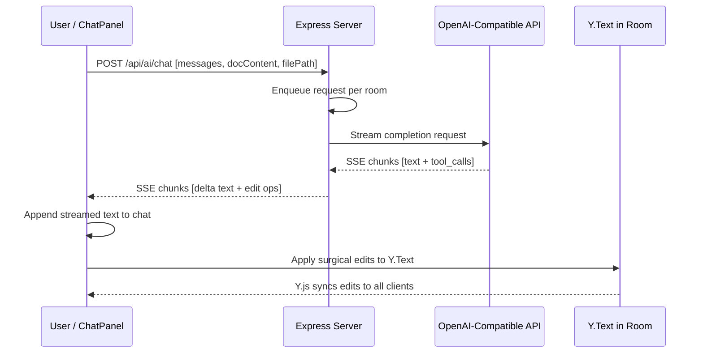
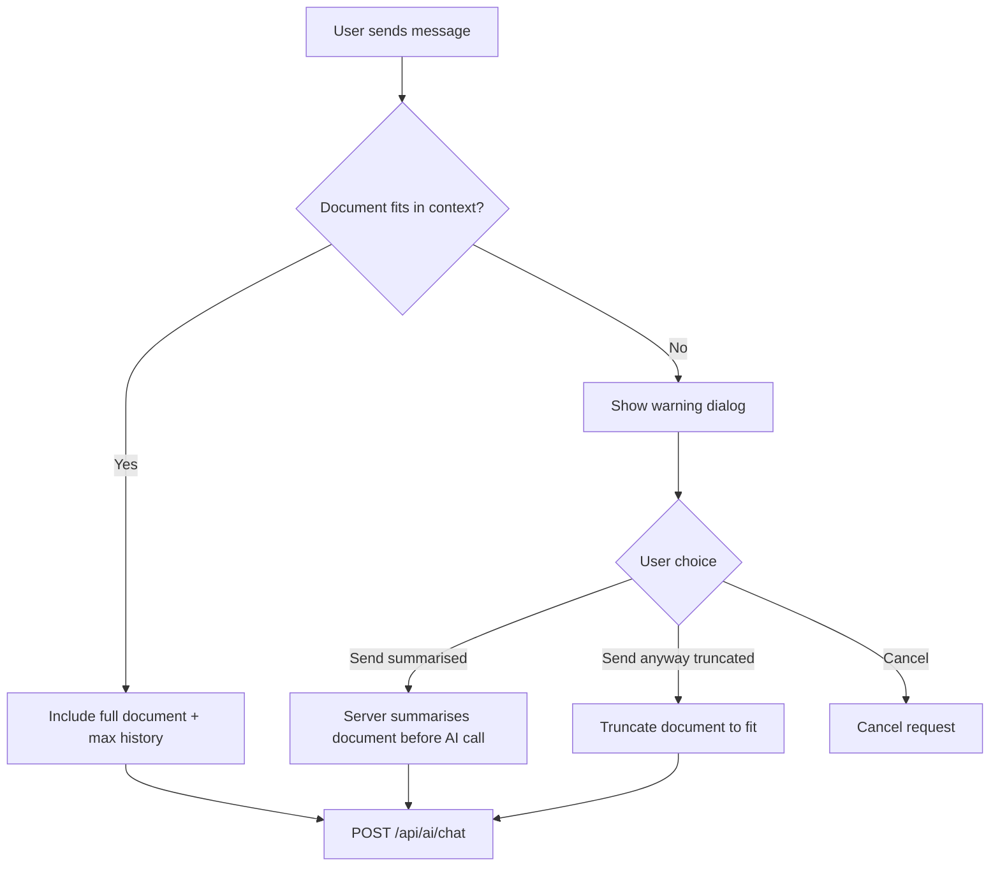

# Phase 1c — AI Chat Integration

## Goal

Add an AI chat sidebar so users can converse with an AI that reads and edits the active Markdown document. AI responses stream in real time, edits are applied surgically via Y.js operations so all collaborators see them instantly, and chat history is persisted per-user in browser localStorage.

---

## Architecture

### High-Level Data Flow



### Key Design Decisions

| Decision | Choice | Rationale |
|---|---|---|
| AI proxy location | Server-side | Keeps API keys out of browser; enables server-side queue and audit logging |
| Streaming protocol | SSE over POST response | Standard pattern matching OpenAI API; no extra WebSocket channel needed |
| Edit application | Client-side via Y.Text | Requesting client applies edits locally; Y.js propagates to all peers automatically — avoids complex server-side Y.js participant |
| Edit instruction format | OpenAI tool/function calling with text-based fallback | Most reliable structured output; graceful degradation for models without tool support |
| Chat storage | Browser localStorage per user per document | Matches spec: chat is not shared between users; persists across refreshes |
| Request queue | Server-side in-memory per room | Prevents parallel AI requests; server is authoritative |
| Thinking indicator | Y.js awareness field | Requesting client sets awareness flag; all peers see it via existing PresenceBar |

---

## Environment Variables

New variables added to `.env`:

```env
# AI Configuration (all optional — AI features disabled when AI_ENDPOINT is unset)
AI_ENDPOINT=          # OpenAI-compatible base URL, e.g. http://localhost:11434/v1
AI_API_KEY=           # Optional API key (omit for local Ollama)
AI_MODEL=llama3       # Model identifier
AI_MAX_TOKENS=4096    # Max response tokens
```

The server exposes a `GET /api/ai/config` endpoint returning `{ enabled, model }` so the client knows whether AI is available without exposing the API key.

---

## Project Structure Changes

```
src/server/
  routes/
    ai.ts                          ← NEW: /api/ai/chat SSE endpoint + /api/ai/config
  services/
    aiService.ts                   ← NEW: OpenAI proxy, prompt builder, queue manager, audit logger

src/client/
  components/ChatPanel/
    ChatPanel.tsx                  ← REWRITE: full chat UI replacing placeholder
    ChatMessage.tsx                ← NEW: individual message bubble component
    ChatInput.tsx                  ← NEW: text input with send button
    EditConfirmation.tsx           ← NEW: inline display of applied edits
  hooks/
    useChatHistory.ts              ← NEW: localStorage persistence for chat messages
    useAiChat.ts                   ← NEW: streaming fetch, edit parsing, queue state
  services/
    applyAiEdits.ts                ← NEW: search/replace operations on Y.Text
```

---

## New Dependencies

| Package | Purpose | Notes |
|---|---|---|
| *None required* | Native `fetch` for AI proxy | Node 18+ includes global fetch; client uses browser fetch + ReadableStream |

No new npm dependencies are needed. The server uses native `fetch` to call the AI endpoint, and the client uses the browser's built-in `ReadableStream` API to consume SSE chunks.

---

## Implementation Steps

### Step 1c.1 — Chat Panel UI

**Goal:** Replace the placeholder `ChatPanel` with a fully functional chat interface scoped to the active document tab.

**Files changed:**
- `src/client/components/ChatPanel/ChatPanel.tsx` — full rewrite
- `src/client/components/ChatPanel/ChatMessage.tsx` — new
- `src/client/components/ChatPanel/ChatInput.tsx` — new
- `src/client/styles/global.css` — chat styles
- `src/client/App.tsx` — pass `activeFilePath` and `identity` props to ChatPanel

**Props for ChatPanel:**
```typescript
interface ChatPanelProps {
  activeFilePath: string | null;
  identity: { name: string; color: string };
  yText: Y.Text | null;          // for applying AI edits
  awareness: Awareness | null;   // for setting AI-thinking flag
}
```

**ChatMessage component:**
```typescript
interface ChatMessageProps {
  role: 'user' | 'assistant' | 'system';
  content: string;
  timestamp: number;
  edits?: Array<{ search: string; replace: string; applied: boolean }>;
  isStreaming?: boolean;
}
```

**UI structure:**
- Header: "Chat" title + clear-history button + AI status indicator
- Scrollable message list with auto-scroll to bottom on new messages
- Each message shows role icon, name, timestamp, and content
- Assistant messages render Markdown content
- Edit operations shown as collapsible diff blocks below the message
- Input area: multi-line textarea with Shift+Enter for newlines, Enter to send
- Send button disabled during streaming or when input is empty
- "AI is thinking..." indicator when a request is in flight
- "AI unavailable" message when `AI_ENDPOINT` is not configured

**Scoping to active document:**
- Chat history is keyed by `filePath` in localStorage
- Switching tabs switches the displayed chat history
- The input and streaming state are per-panel, not per-document

---

### Step 1c.2 — Chat History Persistence

**Goal:** Persist chat messages per-user per-document in browser localStorage.

**Files changed:**
- `src/client/hooks/useChatHistory.ts` — new hook

**Storage key format:** `collab-chat:{filePath}`

**Hook interface:**
```typescript
interface ChatMessage {
  id: string;
  role: 'user' | 'assistant' | 'system';
  content: string;
  timestamp: number;
  edits?: Array<{ search: string; replace: string; applied: boolean }>;
}

function useChatHistory(filePath: string | null): {
  messages: ChatMessage[];
  addMessage: (msg: Omit<ChatMessage, 'id' | 'timestamp'>) => ChatMessage;
  updateMessage: (id: string, updates: Partial<ChatMessage>) => void;
  clearHistory: () => void;
}
```

**Behaviour:**
- On mount or `filePath` change: load messages from `localStorage.getItem('collab-chat:' + filePath)` and parse JSON
- On every mutation: serialize and write back to localStorage
- `addMessage` auto-generates `id` via `crypto.randomUUID()` and `timestamp` via `Date.now()`
- `updateMessage` is used during streaming to append content chunks to the assistant message
- `clearHistory` removes the key from localStorage and resets state
- If localStorage is full: warn in console and continue without persistence (don't crash)

---

### Step 1c.3 — AI Backend with Streaming

**Goal:** Create a server-side proxy that streams AI responses from any OpenAI-compatible endpoint.

**Files changed:**
- `src/server/routes/ai.ts` — new route module
- `src/server/services/aiService.ts` — new service
- `src/server/index.ts` — register `/api/ai` routes
- `.env` — add AI_ENDPOINT, AI_API_KEY, AI_MODEL, AI_MAX_TOKENS

#### Server Route: `POST /api/ai/chat`

**Request body:**
```typescript
interface AiChatRequest {
  filePath: string;                     // active document path (used as room key for queue)
  messages: Array<{                     // chat history
    role: 'user' | 'assistant';
    content: string;
  }>;
  documentContent: string;              // current Y.Text content
  userName: string;                     // for audit trail
}
```

**Response:** SSE stream with the following event types:

```
event: delta
data: {"content": "partial text..."}

event: edit
data: {"edits": [{"search": "old text", "replace": "new text"}]}

event: done
data: {"usage": {"prompt_tokens": 123, "completion_tokens": 456}}

event: error
data: {"message": "Error description"}

event: queued
data: {"position": 2}
```

#### AI Service (`aiService.ts`)

**Responsibilities:**
1. **Prompt building:** Construct the messages array with system prompt, document context, and chat history
2. **Streaming proxy:** Call AI endpoint with `stream: true`, parse SSE chunks, and forward to client
3. **Tool call handling:** Detect and parse `tool_calls` from the AI response for document edits
4. **Queue management:** In-memory queue per room; process one request at a time
5. **Audit logging:** Log each request and its result to server console (and optionally to a log file)

**System prompt (Architect persona):**
```
You are an AI architect assistant embedded in a collaborative Markdown editor.
Your role is to help users write, review, and improve Markdown documents.

When the user asks you to edit the document, use the edit_document tool to make precise, surgical changes.
Never replace the entire document — only modify the specific sections that need changing.

The current document content will be provided. Reference specific sections by quoting them.
Be concise, professional, and helpful.
```

**Tool definition sent to AI:**
```json
{
  "type": "function",
  "function": {
    "name": "edit_document",
    "description": "Make surgical edits to the Markdown document. Each edit specifies exact text to find and its replacement.",
    "parameters": {
      "type": "object",
      "properties": {
        "edits": {
          "type": "array",
          "items": {
            "type": "object",
            "properties": {
              "search": {
                "type": "string",
                "description": "Exact text to find in the document, must match verbatim"
              },
              "replace": {
                "type": "string",
                "description": "Replacement text"
              }
            },
            "required": ["search", "replace"]
          }
        }
      },
      "required": ["edits"]
    }
  }
}
```

**Text-based fallback for models without tool support:**
If the AI response doesn't use tool calls but contains edit blocks in the format:
```
<<<EDIT
SEARCH: exact text to find
REPLACE: replacement text
>>>
```
The server parses these and emits `edit` events.

**Queue implementation:**
```typescript
// In-memory map: roomName → { active: Promise | null, queue: Array<pending> }
const roomQueues = new Map<string, RoomQueue>();
```
- When a request arrives: if no active request for that room, process immediately
- If active: push to queue, send `queued` event with position
- On completion: shift next from queue and process
- Timeout: if AI doesn't respond within 120s, cancel and process next

**Audit logging:**
```typescript
interface AuditEntry {
  timestamp: string;
  userName: string;
  filePath: string;
  promptTokens: number;
  completionTokens: number;
  editsApplied: number;
  duration: number;
}
```
Logged to `console.log` with `[AI-Audit]` prefix. File-based logging deferred to future phase.

#### Config Route: `GET /api/ai/config`

Returns:
```json
{
  "enabled": true,
  "model": "llama3"
}
```
`enabled` is `true` only when `AI_ENDPOINT` is set. Client uses this to show/hide AI features.

---

### Step 1c.4 — Document Context Injection

**Goal:** Send the current document content and chat history to the AI as context.

**Files changed:**
- `src/client/hooks/useAiChat.ts` — new hook
- `src/client/components/ChatPanel/ChatPanel.tsx` — integrate hook

**Hook interface:**
```typescript
function useAiChat(opts: {
  filePath: string | null;
  yText: Y.Text | null;
  awareness: Awareness | null;
  chatHistory: ChatMessage[];
  addMessage: (msg: Omit<ChatMessage, 'id' | 'timestamp'>) => ChatMessage;
  updateMessage: (id: string, updates: Partial<ChatMessage>) => void;
  userName: string;
}): {
  sendMessage: (content: string) => Promise<void>;
  isStreaming: boolean;
  isQueued: boolean;
  queuePosition: number;
  error: string | null;
  aiEnabled: boolean;
}
```

**Document context building (client-side):**
1. Read `yText.toString()` to get current Markdown content
2. Include in request body as `documentContent`
3. Include last N messages from `chatHistory` (where N fits within token budget)

**Streaming consumption:**
1. Send POST to `/api/ai/chat` with `ReadableStream` body parsing
2. Read SSE events using `TextDecoderStream` and line-by-line parsing
3. On `delta` event: append content to the streaming assistant message via `updateMessage`
4. On `edit` event: apply edits to Y.Text and update message with edit details
5. On `done` event: finalize message, clear streaming state
6. On `error` event: display error in chat, allow retry
7. On `queued` event: update queue position indicator

**Awareness integration:**
- When streaming starts: `awareness.setLocalStateField('aiThinking', true)`
- When streaming ends: `awareness.setLocalStateField('aiThinking', false)`
- `PresenceBar` updated to show "🤖 AI thinking..." when any peer has `aiThinking: true`

---

### Step 1c.5 — Context Management & Queuing

**Goal:** Handle token limits gracefully and prevent parallel AI requests per document.

**Files changed:**
- `src/server/services/aiService.ts` — token estimation, summarisation, queue logic
- `src/client/hooks/useAiChat.ts` — context limit warning
- `src/client/components/ChatPanel/ChatPanel.tsx` — summarise prompt UI

**Token estimation:**
- Use a simple heuristic: `Math.ceil(text.length / 4)` for approximate token count
- Compare against a configurable context window (default 8192 tokens, overridable via `AI_CONTEXT_WINDOW` env var)
- Reserve `AI_MAX_TOKENS` for the response
- Available context = `AI_CONTEXT_WINDOW - AI_MAX_TOKENS - systemPromptTokens`

**Context budget allocation:**
1. System prompt: always included (~200 tokens)
2. Document content: always included (highest priority)
3. Chat history: as much as fits, most recent first
4. If document alone exceeds budget: trigger summarise warning

**Context limit warning flow:**


**Summarisation approach:**
- When user opts to summarise: server makes a preliminary AI call with the prompt "Summarise the following Markdown document in under 500 words, preserving key structure and content"
- The summary replaces full document content in the main AI request
- The summary is cached in-memory for subsequent requests until the document changes

**Server-side queue (per room):**
- Max queue depth: 5 requests per room
- If queue is full: reject with HTTP 429 and `error` event
- Queue position broadcast: as each request completes, send updated position to waiting clients
- Timeout: 120 seconds per request; on timeout, cancel via `AbortController` and process next

**Client-side queue UX:**
- When `queued` event received: show "Your request is #N in queue" with a pulsing indicator
- When streaming starts: replace with "AI is responding..."
- Users can cancel their queued request

---

### Step 1c.6 — AI Surgical Editing via Y.js

**Goal:** AI makes targeted edits to the document that appear as real-time changes to all collaborators.

**Files changed:**
- `src/client/services/applyAiEdits.ts` — new module
- `src/client/hooks/useAiChat.ts` — call edit applier
- `src/client/components/ChatPanel/EditConfirmation.tsx` — new component

**Edit application logic:**
```typescript
interface EditOperation {
  search: string;
  replace: string;
}

interface EditResult {
  search: string;
  replace: string;
  applied: boolean;
  reason?: string;  // if not applied: 'not found'
}

function applyAiEdits(yText: Y.Text, edits: EditOperation[]): EditResult[] {
  const results: EditResult[] = [];

  // Apply all edits in a single Y.js transaction for atomicity
  yText.doc!.transact(() => {
    // Process edits in reverse document order to maintain correct indices
    // after earlier edits shift positions
    const sortedEdits = [...edits].map((edit, i) => ({
      ...edit,
      originalIndex: i,
      position: yText.toString().indexOf(edit.search),
    }));
    
    // Sort by position descending so later edits don't shift earlier ones
    sortedEdits.sort((a, b) => b.position - a.position);

    for (const edit of sortedEdits) {
      const content = yText.toString();
      const index = content.indexOf(edit.search);
      
      if (index === -1) {
        results[edit.originalIndex] = {
          search: edit.search,
          replace: edit.replace,
          applied: false,
          reason: 'not found',
        };
        continue;
      }

      // If multiple matches exist, apply to the first occurrence
      yText.delete(index, edit.search.length);
      yText.insert(index, edit.replace);
      results[edit.originalIndex] = {
        search: edit.search,
        replace: edit.replace,
        applied: true,
      };
    }
  }, 'ai-edit');  // origin tag for identifying AI edits

  return results;
}
```

**Transaction origin tag:**
- All AI edits use `'ai-edit'` as the Y.js transaction origin
- This allows future features to distinguish human edits from AI edits (e.g., for undo grouping in Phase 2a)

**EditConfirmation component:**
- Shown inline below the assistant message in the chat panel
- Displays each edit as a mini diff: red for removed text, green for added text
- Shows status: ✅ Applied, ❌ Not found
- Failed edits can be retried manually or the user can ask the AI to try again

**Conflict handling:**
- If another user edits the same region between the AI generating the edit and it being applied, the search text may not match
- In this case: mark the edit as "not found" and notify the user in the chat
- The user can ask the AI to retry with the updated document content

**Awareness indicator updates:**
- Update `PresenceBar` to detect `aiThinking` field in awareness states
- Show a robot icon 🤖 with "AI thinking..." text when any peer has an active AI request
- This provides visibility to all users that an AI edit may appear soon

---

## CSS Changes Summary

New styles to add to `global.css`:

- `.chat-panel` — full height flex column layout
- `.chat-panel-header` — sticky header with title and controls
- `.chat-messages` — scrollable message list with flex-grow
- `.chat-message` — individual message with role-based styling
- `.chat-message-user` / `.chat-message-assistant` — role-specific colours
- `.chat-message-content` — rendered Markdown content within messages
- `.chat-input-area` — sticky bottom input with textarea and send button
- `.chat-edit-block` — collapsible diff display for AI edits
- `.chat-edit-applied` / `.chat-edit-failed` — status-based edit styling
- `.chat-streaming` — pulsing indicator for in-progress responses
- `.chat-queue-indicator` — queue position display
- `.chat-unavailable` — styling for when AI is not configured
- `.ai-thinking-indicator` — robot icon in PresenceBar

---

## Configuration Route and Graceful Degradation

When `AI_ENDPOINT` is not set:
- `GET /api/ai/config` returns `{ enabled: false }`
- `POST /api/ai/chat` returns 503 Service Unavailable
- ChatPanel shows: "AI is not configured. Set AI_ENDPOINT in .env to enable."
- All other editor features work normally — AI is entirely optional

---

## Risk & Decisions

| Risk | Mitigation |
|---|---|
| Ollama models may not support tool calling | Text-based fallback parser for edit instructions |
| AI search text doesn't match due to concurrent edits | Mark as failed, user can retry with updated context |
| Large documents exceed context window | Token estimation + summarise option + truncation fallback |
| AI generates invalid edits or hallucinates text | Client validates each search string exists before applying |
| Multiple users queue many requests | Server-side queue with max depth 5 and 120s timeout |
| SSE connection drops mid-stream | Client detects incomplete response and shows error with retry option |
| localStorage quota exceeded for chat history | Try-catch on writes; warn user; continue without persistence |

---

## Definition of Done — Phase 1c

- [ ] ChatPanel displays scrollable message history scoped to active document
- [ ] Users can type and send messages; Enter sends, Shift+Enter for newlines
- [ ] Chat history persists in localStorage per user per document
- [ ] Clear-history button works
- [ ] Server proxies AI requests to OpenAI-compatible endpoint with streaming
- [ ] AI responses stream token-by-token into the chat panel
- [ ] Current document content is sent as context with each request
- [ ] Chat history is included as context, respecting token budget
- [ ] Context limit warning shown when document exceeds budget
- [ ] Summarise option works for large documents
- [ ] AI can make surgical edits via tool calling or text-based fallback
- [ ] Edits are applied to Y.Text and propagate to all collaborators in real time
- [ ] Edit results shown as inline diffs in chat with success/failure status
- [ ] Request queue prevents parallel AI calls per document
- [ ] Queue position indicator shown to waiting users
- [ ] AI-thinking indicator visible to all users via awareness
- [ ] AI features gracefully disabled when AI_ENDPOINT is not configured
- [ ] Audit log entries printed to server console for each AI interaction
- [ ] `tsc --noEmit` and `vite build` pass cleanly
- [ ] AI-COLLABORATION.md updated with implementation log entries

---

## Known Limitations — Phase 1c by Design

- Audit trail is console-only; file/database logging deferred
- No cross-document context (referencing other open files) — deferred to future
- Token estimation is heuristic, not exact tokenizer
- No retry/resume for interrupted streams — user must resend
- Chat history is local to each browser; not synced between users or devices

---

## Implementation Log

### Date: 6 March 2026

### Overview

Phase 1c delivered the AI chat sidebar with streaming responses, document context injection, per-room request queuing, and surgical document editing via Y.js operations. All six steps from this plan were implemented. The AI features gracefully degrade when `AI_ENDPOINT` is not configured — the editor remains fully functional as a collaborative Markdown editor.

### Architecture

```
User types message
  → ChatPanel → useAiChat hook
    → POST /api/ai/chat (SSE stream)
      → aiService.ts: enqueue, build context, stream from OpenAI-compatible API
        ← SSE events: delta | edit | queued | error | done
      → useAiChat parses SSE, appends deltas to message
        → If edit events: applyAiEdits(yText, edits) — Y.js transaction
          → All peers see edits in real time via Y.js sync
```

### Key Design Decisions

| Decision | Choice | Rationale |
|----------|--------|-----------|
| Edit application | Client-side via Y.js | Edits go through Y.js CRDT, automatically sync to all peers |
| Ambiguous edits (multiple matches) | Apply to first match | Simple, predictable; user can refine with follow-up prompt |
| Cross-document context | Deferred to future phase | Keeps Phase 1c scope manageable |
| Streaming protocol | SSE over POST response | No extra WebSocket needed; works with existing Express setup |
| Request queuing | Per-room in-memory queue | Prevents parallel AI calls from corrupting context |
| Token estimation | `Math.ceil(text.length / 4)` heuristic | Good enough without a tokenizer dependency |
| Edit detection | Tool calls + text-based `<<<EDIT` fallback | Works with models that support function calling and those that don't |

### 16. Chat Panel UI (Step 1c.1)

**Feature**: Full chat interface in the right sidebar panel, replacing the placeholder. Scrollable message history with role-based styling (user/assistant/system), auto-resizing text input, send button, cancel button for in-flight requests, and inline edit confirmation display.

**Implementation**:
- `ChatPanel.tsx` — orchestrates the chat UI, wires up `useChatHistory` and `useAiChat` hooks, auto-scrolls to latest message, shows AI-unavailable state when `AI_ENDPOINT` is not configured
- `ChatMessage.tsx` — individual message bubble with role icon (👤/🤖/ℹ️), timestamp, streaming ellipsis indicator, and `EditConfirmation` for applied edits
- `ChatInput.tsx` — auto-resizing textarea (max 120px), Enter to send, Shift+Enter for newlines, disabled during streaming
- `EditConfirmation.tsx` — inline diff display showing search (red) and replace (green) blocks with applied/failed status indicators
- Comprehensive CSS styles for all chat components including queue indicator, summarise prompt dialog, error display

**Files created**: `src/client/components/ChatPanel/ChatPanel.tsx` (rewritten), `src/client/components/ChatPanel/ChatMessage.tsx`, `src/client/components/ChatPanel/ChatInput.tsx`, `src/client/components/ChatPanel/EditConfirmation.tsx`
**Files changed**: `src/client/styles/global.css`

### 17. Chat History Persistence (Step 1c.2)

**Feature**: Chat messages persist in browser `localStorage` keyed by `collab-chat:{filePath}`, surviving page refreshes. Each document tab has independent chat history. Maximum 200 messages per document (oldest trimmed on overflow).

**Implementation**:
- `useChatHistory` hook manages the message array with `addMessage`, `updateMessage`, and `clearHistory` operations
- Messages are serialised to JSON in localStorage on every change via `useEffect`
- Each message has: `id` (crypto.randomUUID), `role`, `content`, `timestamp`, and optional `edits` array
- Messages load from localStorage on mount, keyed by active file path

**Files created**: `src/client/hooks/useChatHistory.ts`

### 18. AI Backend with Streaming (Step 1c.3)

**Feature**: Express routes that proxy AI requests to any OpenAI-compatible endpoint (Ollama, Claude API, OpenAI, etc.) with SSE streaming responses.

**Implementation**:
- `aiService.ts` — core service with:
  - Config from environment variables: `AI_ENDPOINT`, `AI_API_KEY`, `AI_MODEL`, `AI_MAX_TOKENS`, `AI_CONTEXT_WINDOW`
  - `streamAiChat()` — uses native `fetch` to call OpenAI chat completions API, parses SSE chunks, yields structured events (delta, tool_call, done)
  - Tool definition: `edit_document` function with `edits` array parameter (search/replace pairs)
  - Text-based edit fallback: parses `<<<EDIT ... >>>` blocks for models without function calling
  - Audit logging with `[AI-Audit]` prefix for all requests and edits
  - System prompt loaded dynamically from `docs/SYSTEM-PROMPT.md`
- `ai.ts` routes:
  - `GET /api/ai/config` — returns `{ enabled, model }` for client feature detection
  - `GET /api/ai/budget` — returns token budget information
  - `POST /api/ai/chat` — SSE streaming endpoint with abort controller support

**Files created**: `src/server/services/aiService.ts`, `src/server/routes/ai.ts`
**Files changed**: `src/server/index.ts` (registered AI routes)

### 19. Document Context Injection (Step 1c.4)

**Feature**: The AI receives the current document content and chat history as context with each request. When the document exceeds the context budget, users are prompted to send a summarised version.

**Implementation**:
- `buildMessages()` in aiService constructs the message array: system prompt → document context → chat history (newest first, fitting token budget)
- `summariseDocument()` makes a preliminary AI call to compress large documents before including them as context
- `getContextBudget()` returns token limits for client-side budget display
- Client-side `useAiChat` hook detects when summarisation is needed via `needsSummarisation` flag
- `ChatPanel` shows a summarise prompt dialog when the document exceeds the context budget, letting the user choose to summarise or send as-is

**Files changed**: `src/server/services/aiService.ts`, `src/client/hooks/useAiChat.ts`, `src/client/components/ChatPanel/ChatPanel.tsx`

### 20. Context Management & Queuing (Step 1c.5)

**Feature**: Per-room request queuing prevents parallel AI calls. Queue depth is limited to 5 with a 120-second timeout. Other users see an "AI thinking" indicator in the presence bar.

**Implementation**:
- `enqueueRequest()` / `releaseQueue()` in aiService manage an in-memory queue per room (keyed by file path)
- Queue returns position to client via `queued` SSE event type
- Client `useAiChat` tracks `isQueued` and `queuePosition` state, displayed as a queue indicator in the chat panel
- `PresenceBar.tsx` detects `aiThinking` flag from Y.js awareness states and shows a 🤖 "AI thinking..." indicator with pulse animation
- `useAiChat` sets/clears `awareness.setLocalStateField('aiThinking', true/false)` during AI requests

**Files changed**: `src/server/services/aiService.ts`, `src/client/hooks/useAiChat.ts`, `src/client/components/Editor/PresenceBar.tsx`, `src/client/styles/global.css`

### 21. AI Surgical Editing via Y.js (Step 1c.6)

**Feature**: AI edits are applied as targeted search/replace operations within a single Y.js transaction, preserving cursor positions and propagating to all peers in real time.

**Implementation**:
- `applyAiEdits(yText, edits)` in `applyAiEdits.ts`:
  - Finds each search string in the document text using `indexOf`
  - Sorts matches in reverse document order to maintain correct indices during sequential edits
  - Applies all edits in a single `yText.doc.transact()` with `'ai-edit'` as origin tag
  - Returns `EditResult[]` with success/failure status for each edit
  - Applies to first match when multiple exist (user decision)
- Results are displayed inline in chat messages via `EditConfirmation` component
- Failed edits (search string not found) are shown with a ❌ indicator

**Files created**: `src/client/services/applyAiEdits.ts`

### 22. App-Level Y.js State Sharing

**Feature**: Lifted `useYjsProvider` from EditorPanel to App.tsx so both EditorPanel and ChatPanel share the same Y.js document state and awareness instance.

**Implementation**:
- `App.tsx` calls `useYjsProvider(activeFilePath)` and passes `yText`, `awareness`, `connected` as props to both EditorPanel and ChatPanel
- `EditorPanel` no longer calls `useYjsProvider` internally — receives Y.js state as props
- This ensures ChatPanel operates on the exact same Y.Text instance that the editor uses

**Files changed**: `src/client/App.tsx`, `src/client/components/Editor/EditorPanel.tsx`

### Files Created

| File | Purpose |
|------|---------|
| `src/client/hooks/useChatHistory.ts` | localStorage persistence for chat messages |
| `src/client/hooks/useAiChat.ts` | Client streaming hook with SSE parsing |
| `src/client/services/applyAiEdits.ts` | Y.js surgical editing (search/replace) |
| `src/client/components/ChatPanel/ChatPanel.tsx` | Full chat interface (rewritten from placeholder) |
| `src/client/components/ChatPanel/ChatMessage.tsx` | Individual message bubble component |
| `src/client/components/ChatPanel/ChatInput.tsx` | Auto-resizing text input component |
| `src/client/components/ChatPanel/EditConfirmation.tsx` | Inline edit diff display |
| `src/server/services/aiService.ts` | AI proxy service with streaming and queuing |
| `src/server/routes/ai.ts` | Express routes for AI endpoints |

### Files Modified

| File | Changes |
|------|---------|
| `src/server/index.ts` | Registered AI routes (`app.use('/api', aiRouter)`) |
| `src/client/App.tsx` | Lifted `useYjsProvider` to app level, pass props to both panels |
| `src/client/components/Editor/EditorPanel.tsx` | Accept Y.js state as props instead of internal hook |
| `src/client/components/Editor/PresenceBar.tsx` | AI thinking indicator from awareness states |
| `src/client/styles/global.css` | Comprehensive chat panel styles, AI thinking animation |
| `.env` | Added AI configuration variables |

### Build Verification

| Check | Result |
|-------|--------|
| `tsc --noEmit` | ✅ No type errors |
| `vite build` | ✅ Built successfully (10.63s, 1429 modules) |

---

## Post-Implementation Fixes

### 23. .env Not Loading in Dev Mode (DEV-ISSUE-013)

**Problem:** `AI_ENDPOINT` set in `.env` had no effect during `npm run dev` — no `dotenv` package and `tsx` doesn't support `--env-file`.

**Fix:** Changed `package.json` `dev:server` script to use POSIX shell sourcing:
```json
"dev:server": "set -a && . ./.env && set +a && tsx watch src/server/index.ts"
```

See [DEV-ISSUE-013](dev-issues.md#dev-issue-013-env-not-loading-in-dev-mode) for full write-up.

### 24. Docker-Specific Env Vars Breaking Dev Mode (DEV-ISSUE-014)

**Problem:** After env fix, `DOCS_PATH=/app/docs` from `.env` overrode the dev-mode fallback, causing the file browser to show only cached files.

**Fix:** Moved `DOCS_PATH` and `PORT` from `.env` to `docker-compose.yml` `environment:` block. `.env` now contains only shared config (AI settings).

See [DEV-ISSUE-014](dev-issues.md#dev-issue-014-file-browser-only-showing-one-file-after-env-fix) for full write-up.

### 25. AI SSE Stream Aborted Immediately (DEV-ISSUE-015)

**Problem:** `req.on('close')` in the `/api/ai/chat` route fired immediately after the POST body was consumed (Node.js >= 18 behavior), setting `cancelled = true` and aborting the AI stream before it started. Every request returned 200 OK with SSE headers but zero bytes of event data.

**Fix:** Switched to `res.on('close')` with a `res.writableFinished` guard to correctly detect only premature client disconnection.

See [DEV-ISSUE-015](dev-issues.md#dev-issue-015-ai-sse-stream-aborted-immediately--empty-response) for full write-up.

### 26. Dynamic System Prompt via SYSTEM-PROMPT.md

**Enhancement:** System prompt is no longer hardcoded. The AI service reads `docs/SYSTEM-PROMPT.md` on every request via `loadSystemPrompt()`, with a built-in fallback. The file can be edited within the editor itself and changes take effect on the next AI message. Controlled by `AI_TOOLS_ENABLED` env var for tool-calling support.

### 27. Empty Document Validation Fix (DEV-ISSUE-016)

**Bug:** Sending an AI chat message for a newly created (empty) file returned 400 Bad Request. The validation `!documentContent` treated empty string `""` as falsy. Fixed by switching to `documentContent === undefined || documentContent === null`.

See [DEV-ISSUE-016](dev-issues.md#dev-issue-016-ai-chat-returns-400-for-empty-documents) for full write-up.

### Files Modified (Post-Implementation Fixes)

| File | Changes |
|------|---------|
| `package.json` | `dev:server` script uses POSIX env sourcing |
| `.env` | Removed `DOCS_PATH` and `PORT`; added `AI_TOOLS_ENABLED=true` |
| `docker-compose.yml` | Added `environment:` block with `DOCS_PATH` and `PORT` |
| `src/server/routes/ai.ts` | Fixed `req.on('close')` → `res.on('close')` with `writableFinished` guard; fixed empty-document validation |
| `src/server/services/aiService.ts` | Dynamic system prompt from `SYSTEM-PROMPT.md`; `AI_TOOLS_ENABLED` config |
| `docs/SYSTEM-PROMPT.md` | New file — architect persona system prompt, editable within the editor |
| `plans/dev-issues.md` | Added DEV-ISSUE-013, 014, 015, 016 |
