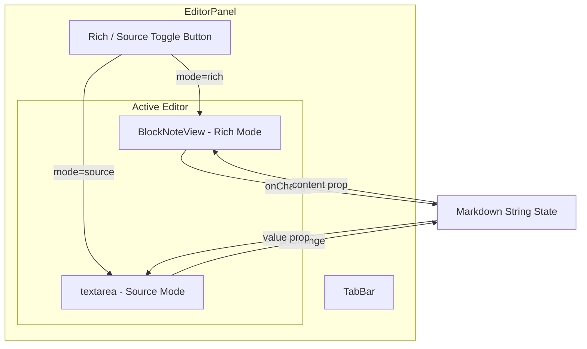
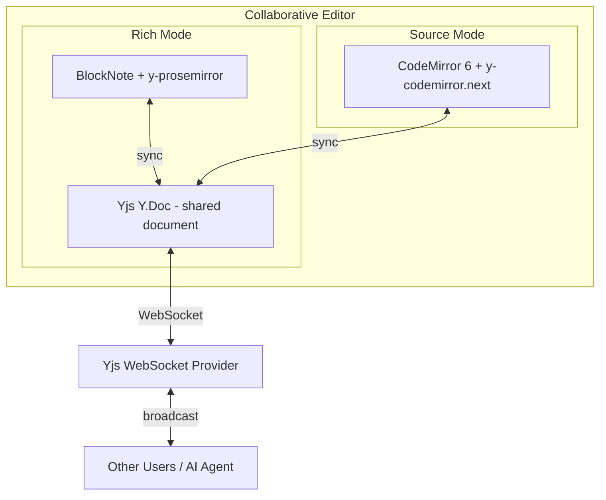

# Source Mode Toggle — Plan

## Summary

Add a Rich/Source toggle to the markdown editor so users can switch between BlockNote WYSIWYG mode and raw markdown editing. Implement in two stages: a zero-dependency textarea now (phase 1a), with a clear upgrade path to CodeMirror 6 + Yjs for real-time collaboration later.

## Why

- **AI collaboration**: The AI chat (phase 1c) needs to read and write raw markdown. A source view makes AI edits transparent and debuggable.
- **Round-trip fidelity**: `blocksToMarkdownLossy()` loses some formatting. Source mode gives users full control.
- **Power users**: Experienced markdown authors often prefer typing raw syntax over clicking toolbar buttons.

## Architecture — Phase 1a (Textarea)



### Key Design Decisions

| Decision | Choice | Rationale |
|---|---|---|
| Toggle scope | Per-editor, not global | Each tab can independently be in rich or source mode |
| Toggle state storage | React state in MarkdownEditor | Simple; no need to persist across sessions yet |
| Source editor - phase 1a | Plain textarea | Zero dependencies, trivial to implement |
| Content sync on toggle | Serialize/parse on mode switch | Rich→Source: blocksToMarkdownLossy (normalized). Source→Rich: tryParseMarkdownToBlocks. Skips re-serialization if no rich edits occurred. |
| Unsaved state | Same isDirty tracking as today | Both modes feed into the same onChange callback |

### Files to Modify

| File | Change |
|---|---|
| [`MarkdownEditor.tsx`](src/client/components/Editor/MarkdownEditor.tsx) | Add mode state, toggle button, textarea, and sync logic |
| [`global.css`](src/client/styles/global.css) | Add styles for toggle button and source textarea |

No new files needed. No new dependencies.

### Implementation Detail — MarkdownEditor.tsx

The component gains a `mode` state: `'rich' | 'source'`.

**Toggle behaviour:**
1. **Rich → Source**: Call `blocksToMarkdownLossy()` to get current markdown, set as textarea value
2. **Source → Rich**: Call `tryParseMarkdownToBlocks()` with textarea content, replace editor blocks
3. Both transitions call `onChange` so dirty tracking remains consistent

**Textarea specifics:**
- Monospace font, full height of editor area
- Tab key inserts `\t` or 2 spaces instead of changing focus
- Ctrl+S still triggers save via existing EditorPanel keydown handler
- Line numbers are a nice-to-have but not required for phase 1a

### Acceptance Criteria — Phase 1a

- [ ] Toggle button visible in the editor toolbar area, showing current mode
- [ ] Clicking toggle switches between BlockNote rich view and raw textarea
- [ ] Content syncs correctly in both directions on toggle
- [ ] Edits in source mode trigger onChange and mark tab as dirty
- [ ] Ctrl+S saves from source mode
- [ ] Each open tab independently tracks its own rich/source mode

---

## Architecture — Future: CodeMirror 6 Upgrade

When real-time collaboration is added (phase 1b/1c), the plain textarea gets replaced with CodeMirror 6.



### The Yjs Challenge: Dual-View Sync

The core difficulty is that BlockNote stores a **ProseMirror document tree** in the Y.Doc, while CodeMirror stores a **plain text string**. These are fundamentally different data models.

**Options:**

| Approach | Pros | Cons |
|---|---|---|
| A: Two Y.Doc fields - Y.XmlFragment for rich, Y.Text for source | Both editors get native Yjs collab | Must sync between the two representations; risk of divergence |
| B: Single Y.Text - markdown only, BlockNote parses on render | One source of truth; source mode is the canonical format | BlockNote loses real-time cursor awareness; re-parsing on every remote change is expensive |
| C: Single Y.XmlFragment - serialize to markdown for source view | BlockNote is the canonical format | Source mode becomes read-only during collab, or edits must be diffed back to ProseMirror |
| **D: Mode lock during collab** | Simple; avoid the dual-representation problem entirely | Only one view active at a time per document across all users |

**Recommended: Approach B with lazy sync**
- Canonical format is **Y.Text containing markdown**
- Source mode: CodeMirror binds directly to Y.Text via `y-codemirror.next` — full real-time collab
- Rich mode: BlockNote renders from a parsed snapshot of Y.Text, with periodic re-sync
- AI agent writes directly to Y.Text (it thinks in markdown anyway)
- Trade-off: Rich mode may have brief delay on remote edits, but source mode is always live

### Dependencies for CodeMirror Upgrade

```json
{
  "codemirror": "^6.0",
  "@codemirror/lang-markdown": "^6.0",
  "@codemirror/theme-one-dark": "^6.0",
  "y-codemirror.next": "^0.3",
  "yjs": "^13.6",
  "y-websocket": "^2.0"
}
```

### Migration Steps (future, not phase 1a)

1. Add CodeMirror 6 as a dependency
2. Create `SourceEditor.tsx` wrapping CodeMirror with markdown language support
3. Replace the textarea in MarkdownEditor with SourceEditor
4. Add Yjs provider setup (WebSocket or WebRTC)
5. Bind CodeMirror to Y.Text via y-codemirror.next
6. Adapt BlockNote to read from the same Y.Text
7. Add cursor awareness (user names/colors) for both views

---

## Implementation Plan — Phase 1a Only

These are the concrete steps to implement now:

1. Add `mode` state and toggle button to `MarkdownEditor.tsx`
2. Add textarea source view component within `MarkdownEditor.tsx`
3. Implement Rich→Source sync using `blocksToMarkdownLossy()`
4. Implement Source→Rich sync using `tryParseMarkdownToBlocks()`
5. Add CSS styles for toggle button and source textarea
6. Test: toggle preserves content, dirty tracking works, Ctrl+S saves from both modes
